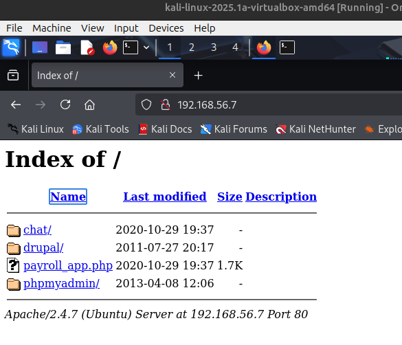
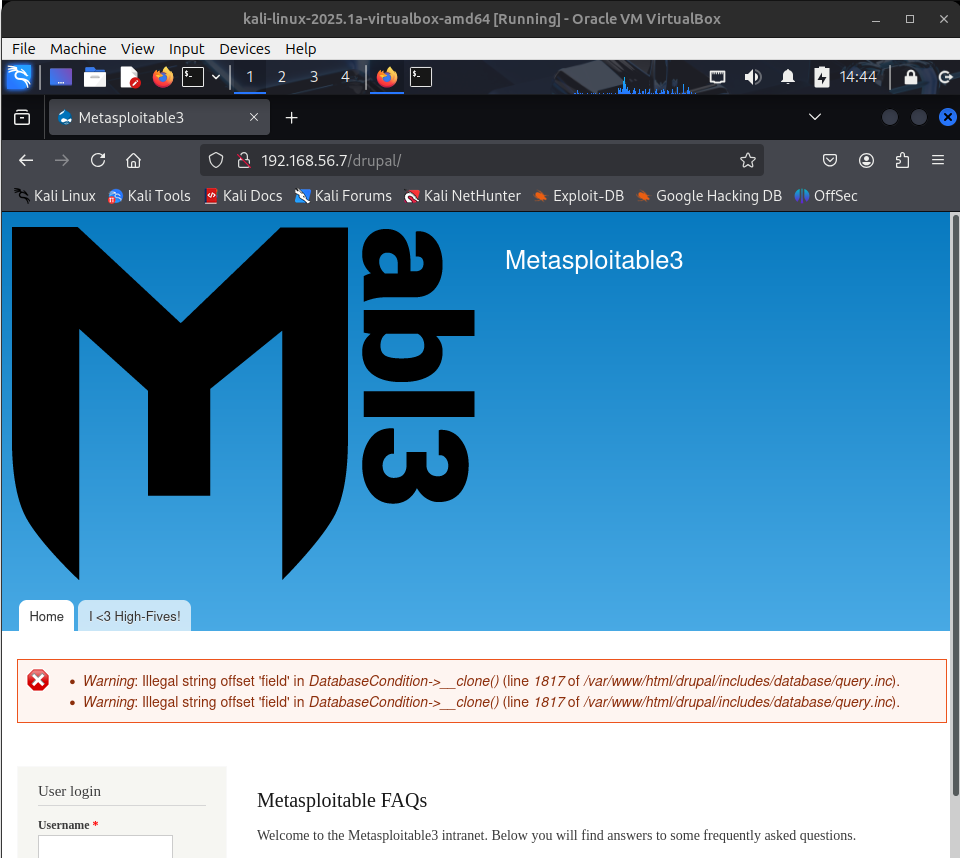

# H1
Tehtävänanto: Tero Karvinen, Tunkeutumistestaus, https://terokarvinen.com/tunkeutumistestaus/

- x)
> Lue/katso/kuuntele ja tiivistä. (Tässä x-alakohdassa ei tarvitse tehdä testejä tietokoneella, vain lukeminen tai kuunteleminen ja tiivistelmä riittää. Tiivistämiseen riittää muutama ranskalainen viiva.)
> - Herrasmieshakkerit (RSS) tai Darknet Diaries (RSS) , yksi vapaavalintainen jakso jommasta kummasta. Voi kuunnella myös lenkillä, pyykiä viikatessa tms. Siisti koti / hyvä kunto kaupan päälle.
> - Hutchins et al 2011: Intelligence-Driven Computer Network Defense Informed by Analysis of Adversary Campaigns and Intrusion Kill Chains, chapters Abstract, 3.2 Intrusion Kill Chain.
> - € Santos et al: The Art of Hacking (Video Collection): 4.3 Surveying Essential Tools for Active Reconnaissance. Sisältää porttiskannauksen. 5 videota, yhteensä noin 20 min.
> - KKO 2003:36.

- i) Kuuntelin Herrasmieshakkerit, Superposition äärellä, vieraana Juha Vartiainen, 23.12.2024.

Podcastin aiheena oli kvanttitietokoneet, mitä ne ovat ja mitä niillä voi tehdä. Puhuttiin myös kvanttitietokoneiden tulevaisuudesta.

- ii)

Intrusion Kill Chainin seitsemän osaa[^13], jotka hyökkääjän tulee suorittaa yksi kerrallaan onnistuakseen:
- Tiedustelu
    - Tiedon keräys kohteesta julkisista lähteistä, esim. verkkosivut, konferenssit.
- Aseistautuminen
    - Muodostetaan hyökkäystä varten räätälöity paketti
- Toimitus
    - Lähetetään paketti esim. sähköpostiin kalasteluviestinä
- Hyväksikäyttö
    - Haitallinen ohjelma käynnistyy käyttämällä hyväksi jotakin tunnettua haavoittuvuutta
- Asennus
    - Backdoorin tai RAT:n asennus, jotta hyökkääjä pääsee käsiksi manuaalisesti kohteeseen
- Komentoyhteys
    - Kohde on hyökkääjän hallinnassa
- Tavoitteiden toteutus
    - Kohteessa suoritetaan hyökkäystoimet, esim. tietojen varastaminen

Kokonaisuudessaan artikkeli vaikutti varsin mielenkiintoiselta. Voisi lukea kokonaan.

- iii) Maksumuurin takana niin ei tullut katsottua.
- iv)
Nuori henkilö oli tehnyt porttiskannauksen pankin palvelimelle, tullut iso juttu ja suuret seuraamukset. Erikoista tässä oli, että tuomioistuin oli katsonut
silti, että porttiskannauksen tarkoitus oli ollut aggressiivinen ja hyökkäävä, vaikka kyseessä on melko nuori, jolla ei kuitenkaan voi välttämättä olla 
suurempaa käsitystä tekojensa vakavuudesta.

***

- a)
> Asenna Kali virtuaalikoneeseen.

Tässä meni kaikki OK suoraan Kalin ohjeilla[^1].

- b)
> Irrota Kali-virtuaalikone verkosta. Todista testein, että kone ei saa yhteyttä Internetiin (esim. 'ping 8.8.8.8')

Virtuaboxia käyttämällä voidaan asettaa Kalin network adapter -> Not attached defaultiksi näin: 
sulje Kali (power off) -> settings -> network -> adapter -> attached to: not attached. Tällöin aina, kun kali VM käynnistetään,
se ei ole mihinkään verkkoon yhteydessä.[^5]

Nyt testaamalla `ping 8.8.8.8` saadaan:
```bash
┌──(kali㉿kali)-[~]
└─$ ping 8.8.8.8       
ping: connect: Network is unreachable

```

- c, d)
> - Porttiskannaa 1000 tavallisinta tcp-porttia omasta koneestasi (nmap -T4 -A localhost). Selitä komennon paramterit. Analysoi ja selitä tulokset.
> - Asenna kaksi vapaavalintaista demonia ja skannaa uudelleen. Analysoi ja selitä erot.

Komennon `nmap -T4 -A localhost` lippu `T4` on timing template[^6], joka on nimetty aggressiiviseksi. Lipun aggressiivisuuden tarkoitus on määrittää kuinka monta
verkkopyyntöä lyhyen ajan sisällä komento lähettää. Näköjään hitaissa verkoissa liian aggressiivinen määrä verkkopyyntöjä voi kaataa hostin, joka voidaan varmaankin
luokitella palvelunestohyökkäykseksi. `A`-lippu asettaa käyttöjärjestelmän tunnistuksen, version tunnistuksen, script skannauksen, ja tracerouten päälle[^2]. `A`-lippu
on hyvin hyödyllisen oloinen työkalu, jolla saadaan paljon lisätietoa portin takana työskentelevästä ohjelmasta.

Skannasin virtuaalikoneen, jossa on apache2 ja salt-master käynnissä. Apache2:n avaama portti löytyy, mutta eikö myöskin Salt-masterin portti pitäisi näkyä?
Tähän löytyy helppo vastaus, sillä komento tarkastelee vain 1000 useiten käytettyä porttia. Luultavasti siis saltin portit eivät kuulu tähän listaan.[^7]

```bash
┌──(kali㉿kali)-[~]
└─$ nmap -T4 -A 192.168.56.102                
Starting Nmap 7.95 ( https://nmap.org ) at 2025-03-31 13:11 EDT
mass_dns: warning: Unable to determine any DNS servers. Reverse DNS is disabled. Try using --system-dns or specify valid servers with --dns-servers
Nmap scan report for 192.168.56.102
Host is up (0.00033s latency).
Not shown: 999 closed tcp ports (reset)
PORT   STATE SERVICE VERSION
80/tcp open  http    Apache httpd 2.4.62 ((Debian))
|_http-server-header: Apache/2.4.62 (Debian)
|_http-title: Apache2 Debian Default Page: It works
MAC Address: 08:00:27:C1:F0:3B (PCS Systemtechnik/Oracle VirtualBox virtual NIC)
Device type: general purpose|router
Running: Linux 4.X|5.X, MikroTik RouterOS 7.X
OS CPE: cpe:/o:linux:linux_kernel:4 cpe:/o:linux:linux_kernel:5 cpe:/o:mikrotik:routeros:7 cpe:/o:linux:linux_kernel:5.6.3
OS details: Linux 4.15 - 5.19, OpenWrt 21.02 (Linux 5.4), MikroTik RouterOS 7.2 - 7.5 (Linux 5.6.3)
Network Distance: 1 hop

TRACEROUTE
HOP RTT     ADDRESS
1   0.33 ms 192.168.56.102

OS and Service detection performed. Please report any incorrect results at https://nmap.org/submit/ .
Nmap done: 1 IP address (1 host up) scanned in 7.73 seconds
```
Komennon ajosta nähdään, että se tunnisti 1000:sta portista yhden avoimen, ja 999 suljettua porttia. Olettaa voisi, että ilman demoneja (ja ilman muita avoimia portteja)
näkyisi, että komento löytää kaikki 1000 porttia olevan kiinni.

nmap ei näköjään oikein osaa tunnistaa kohteen käyttöjärjestelmää (Debian 12), vaan arvaa sen olevan 
```bash
OS details: Linux 4.15 - 5.19, OpenWrt 21.02 (Linux 5.4), MikroTik RouterOS 7.2 - 7.5 (Linux 5.6.3)
```

Tarkastelin salt-masterin portit (4505 ja 4506) vielä erikseen.
```bash
┌──(kali㉿kali)-[~]
└─$ nmap -p 4505,4506 192.168.56.102

Starting Nmap 7.95 ( https://nmap.org ) at 2025-03-31 13:21 EDT
mass_dns: warning: Unable to determine any DNS servers. Reverse DNS is disabled. Try using --system-dns or specify valid servers with --dns-servers
Nmap scan report for 192.168.56.102
Host is up (0.00035s latency).

PORT     STATE SERVICE
4505/tcp open  unknown
4506/tcp open  unknown
MAC Address: 08:00:27:C1:F0:3B (PCS Systemtechnik/Oracle VirtualBox virtual NIC)

Nmap done: 1 IP address (1 host up) scanned in 0.14 seconds
```

Eli portit näyttävät olevan auki, mutta serviceä nmap ei osaa kertoa.

- e)
> Asenna Metasploitable 2 virtuaalikoneeseen

Seurattu täysin metasploitable3:n ohjeita[^3]. Vagrant piti myös ladata ja asentaa näiden omilla ohjeilla[^4].

Itse olen asettamassa host-only verkon IP-osoitealueeksi `192.168.56.0/24`

Huomasin, että `vagrant up` -komentoa ajamalla asetetaan mielenkiintoisesti VM hetkellisesti vaaralliseen tilaan. Sillä aikaa, kun vagrant ajaa koneita 
ylös, on network adapter asetettu NAT:ksi. Tällöin metasploitable-koneella on yhteys internetiin. Eli kun ensimmäisen bootin on tehnyt, täytyy ehdottomasti
sulkea VM, poistaa tältäkin yhteys verkosta asettamalla network adapter: not attached ennen kuin sen kanssa alkaa leikkimään.

Ohessa oma Vagrantfile, jolla saan pakotettua network adapterin olemaan host-onlyna. `config.vm.network "private_network", type: "dhcp"` 
asettaa adapteriksi host-only, ja `vb.customize ["modifyvm", :id, "--nic1", "none"]` asettaa Vagrantin asettaman default NIC:n (eli NAT) pois päältä.[^8][^9]
```bash
Vagrant.configure("2") do |config|
  config.vm.box = "rapid7/metasploitable3-ub1404"
  config.vm.network "private_network", type: "dhcp"
  config.vm.provider "virtualbox" do |vb|
    vb.customize ["modifyvm", :id, "--nic1", "none"]
  end
end
```

Tosiaan metasploitable, ja muutkin Vagrantfileen laitetut koneet täytyy aina ajaa komennolla `vagrant up`, koska muuten voi jäädä tärkeät konfiguraatiot pois,
jos ne esim. vain käynnistää virtualboxista.

- f, g)
> Tee koneiden välille virtuaaliverkko. Jos säätelet VirtualBoxista
> - Kali saa yhteyden Internettiin, mutta sen voi laittaa pois päältä
> - Kalin ja Metasploitablen välillä on host-only network, niin että porttiskannatessa ym. koneet on eristetty intenetistä, mutta ne saavat yhteyden toisiinsa
> - Vaihtoehtoisesti voit tehdä molempien koneiden asennuksen ja virtuaaliverkon vagrantilla. Silloin molemmat koneet samaan Vagrantfile:n.
> - Etsi Metasploitable porttiskannaamalla (nmap -sn). Tarkista selaimella, että löysit oikean IP:n - Metasploitablen weppipalvelimen etusivulla lukee Metasploitable.


Tein virtuaaliverkon aluksi Kali ja Debian-koneiden välille jotakuinkin samalla tapaa, kuin b)-kohdassa asetin internet yhteyden oletuksena pois päältä.

Virtualboxilla voidaan tehdä oma host-only verkko menemällä virtualboxin pääsivulta File -> Tools -> Network manager. Aukeaa uusi pikkuikkuna virtualboxissa. 
Mennään Host-only networks -lehdykälle, josta painetaan sen jälkeen create. Adapterille ja DHCP:lle voidaan antaa olla automaattiset asetukset.

Omassa tapauksessani vielä kaikilla virtuaalikoneilla minun piti tietysti ensin asettaa network adapter -> attached to: host-only. Sen jälkeen disconnect -> connect
jolloin DHCP antaa uuden IP:n host-only verkossa.

Tarkistetaan päätelaitteet host-only verkossa ping scan-komennolla[^2] `nmap -sn 192.168.56.0/24` joka pingaa kaikkia laitteita ICMP echo requestilla tässä IP-alueella.
```bash
┌──(kali㉿kali)-[~]
└─$ nmap -sn 192.168.56.0/24

Starting Nmap 7.95 ( https://nmap.org ) at 2025-03-31 11:56 EDT
mass_dns: warning: Unable to determine any DNS servers. Reverse DNS is disabled. Try using --system-dns or specify valid servers with --dns-servers
Nmap scan report for 192.168.56.1
Host is up (0.00017s latency).
MAC Address: 0A:00:27:00:00:00 (Unknown)
Nmap scan report for 192.168.56.100
Host is up (0.00014s latency).
MAC Address: 08:00:27:92:E1:3E (PCS Systemtechnik/Oracle VirtualBox virtual NIC)
Nmap scan report for 192.168.56.102
Host is up (0.00027s latency).
MAC Address: 08:00:27:C1:F0:3B (PCS Systemtechnik/Oracle VirtualBox virtual NIC)
Nmap scan report for 192.168.56.101
Host is up.
Nmap done: 256 IP addresses (4 hosts up) scanned in 1.81 seconds
```

Näistä IP-osoitteista:
- 192.168.56.1 on host-only verkon adapteri, host kone (ks. host-only verkon teossa näkyvä IPv4 prefix alla oleva IP-osoite. File -> Network Manager -> host-only verkon tiedot)
- 192.168.56.100 on tuntematon, en ole yhtään varma, mikä laite tässä on havaittu.. Selkeästi jokin VM:n osa, kun käyttää virtualboxin NICiä.
- 192.168.56.101 on Kali VM:n IP-osoite.
- 192.168.56.102 on Debian VM:n IP-osoite.

Tein tämän vielä metasploitable-koneelle myös. Tarkistin metasploitable-koneelta hostnamen
```bash
vagrant@ubuntu:~$ ping 8.8.8.8
connect: Network is unreachable
^C
vagrant@ubuntu:~$ hostname -I
192.168.56.7 172.17.0.1
vagrant@ubuntu:~$
```
En ihan tiedä, miksi vagrant silti pakottaa tuota 172.17.0.1 IP:tä koneelle, mutta olkoot. Kalilla hyökätään 192-alkuiseen osoitteeseen.
```bash
┌──(kali㉿kali)-[~]
└─$ nmap -sn 192.168.56.0/24

Starting Nmap 7.95 ( https://nmap.org ) at 2025-03-31 14:25 EDT
mass_dns: warning: Unable to determine any DNS servers. Reverse DNS is disabled. Try using --system-dns or specify valid servers with --dns-servers
Nmap scan report for 192.168.56.1
Host is up (0.00019s latency).
MAC Address: 0A:00:27:00:00:00 (Unknown)
Nmap scan report for 192.168.56.2
Host is up (0.00018s latency).
MAC Address: 08:00:27:92:99:03 (PCS Systemtechnik/Oracle VirtualBox virtual NIC)
### ---v Apurivi erottamaan kohde
Nmap scan report for 192.168.56.7
Host is up (0.00023s latency).
MAC Address: 08:00:27:EF:BC:83 (PCS Systemtechnik/Oracle VirtualBox virtual NIC)
### Apurivi erottamaan kohde ---^
Nmap scan report for 192.168.56.101
Host is up.
Nmap done: 256 IP addresses (4 hosts up) scanned in 1.99 seconds
```

Kali löytää verkosta metasploitable-koneen. Tarkastetaan vielä selaimella.





- h)
> Porttiskannaa Metasploitable huolellisesti ja kaikki portit (nmap -A -T4 -p-). Poimi 2-3 hyökkääjälle kiinnostavinta porttia. Analysoi ja selitä tulokset näiden porttien osalta.

Aloitetaan komennolla `nmap -A -T4 192.168.56.7`, joka skannaa jokaisen "yleisen" portin, tällä saadaan jo jokin idea siitä, mitkä portit ovat kuuntelemassa.
```bash
┌──(kali㉿kali)-[~]
└─$ nmap -T4 -A 192.168.56.7
Starting Nmap 7.95 ( https://nmap.org ) at 2025-03-31 14:47 EDT
mass_dns: warning: Unable to determine any DNS servers. Reverse DNS is disabled. Try using --system-dns or specify valid servers with --dns-servers
Nmap scan report for 192.168.56.7
Host is up (0.00028s latency).
Not shown: 991 filtered tcp ports (no-response)
PORT     STATE  SERVICE     VERSION
21/tcp   open   ftp         ProFTPD 1.3.5
22/tcp   open   ssh         OpenSSH 6.6.1p1 Ubuntu 2ubuntu2.13 (Ubuntu Linux; protocol 2.0)
| ssh-hostkey: 
|   1024 2b:2e:1f:a4:54:26:87:76:12:26:59:58:0d:da:3b:04 (DSA)
|   2048 c9:ac:70:ef:f8:de:8b:a3:a3:44:ab:3d:32:0a:5c:6a (RSA)
|   256 c0:49:cc:18:7b:27:a4:07:0d:2a:0d:bb:42:4c:36:17 (ECDSA)
|_  256 a0:76:f3:76:f8:f0:70:4d:09:ca:e1:10:fd:a9:cc:0a (ED25519)
80/tcp   open   http        Apache httpd 2.4.7
| http-ls: Volume /
| SIZE  TIME              FILENAME
| -     2020-10-29 19:37  chat/
| -     2011-07-27 20:17  drupal/
| 1.7K  2020-10-29 19:37  payroll_app.php
| -     2013-04-08 12:06  phpmyadmin/
|_
|_http-title: Index of /
|_http-server-header: Apache/2.4.7 (Ubuntu)
445/tcp  open   netbios-ssn Samba smbd 4.3.11-Ubuntu (workgroup: WORKGROUP)
631/tcp  open   ipp         CUPS 1.7
| http-robots.txt: 1 disallowed entry 
|_/
|_http-server-header: CUPS/1.7 IPP/2.1
|_http-title: Home - CUPS 1.7.2
| http-methods: 
|_  Potentially risky methods: PUT
3000/tcp closed ppp
3306/tcp open   mysql       MySQL (unauthorized)
8080/tcp open   http        Jetty 8.1.7.v20120910
|_http-title: Error 404 - Not Found
|_http-server-header: Jetty(8.1.7.v20120910)
8181/tcp closed intermapper
MAC Address: 08:00:27:EF:BC:83 (PCS Systemtechnik/Oracle VirtualBox virtual NIC)
Aggressive OS guesses: Linux 3.2 - 4.14 (98%), Linux 3.8 - 3.16 (98%), Linux 3.10 - 4.11 (94%), Linux 3.13 - 4.4 (94%), Linux 3.13 (94%), Linux 3.13 - 3.16 (94%), OpenWrt Chaos Calmer 15.05 (Linux 3.18) or Designated Driver (Linux 4.1 or 4.4) (94%), Linux 4.10 (94%), Android 5.0 - 6.0.1 (Linux 3.4) (94%), Android 8 - 9 (Linux 3.18 - 4.4) (94%)
No exact OS matches for host (test conditions non-ideal).
Network Distance: 1 hop
Service Info: Hosts: 127.0.0.1, UBUNTU; OSs: Unix, Linux; CPE: cpe:/o:linux:linux_kernel

Host script results:
| smb2-security-mode: 
|   3:1:1: 
|_    Message signing enabled but not required
|_clock-skew: mean: 0s, deviation: 2s, median: -2s
| smb2-time: 
|   date: 2025-03-31T18:47:20
|_  start_date: N/A
| smb-os-discovery: 
|   OS: Windows 6.1 (Samba 4.3.11-Ubuntu)
|   Computer name: ubuntu
|   NetBIOS computer name: UBUNTU\x00
|   Domain name: \x00
|   FQDN: ubuntu
|_  System time: 2025-03-31T18:47:23+00:00
| smb-security-mode: 
|   account_used: guest
|   authentication_level: user
|   challenge_response: supported
|_  message_signing: disabled (dangerous, but default)

TRACEROUTE
HOP RTT     ADDRESS
1   0.28 ms 192.168.56.7

OS and Service detection performed. Please report any incorrect results at https://nmap.org/submit/ .
Nmap done: 1 IP address (1 host up) scanned in 54.79 seconds
```

Melkoiset lokit tuli siitä komennosta. Tässä komennossa taas T4 lippu suorittaa aggressiivinen skannauksen kaikille tuon IP-osoitteen porteille. 
A lippu on erityisen hyödyllinen, koska se antaa runsaasti lisätietoja siitä mikä/kuka portin takana kuuntelee.

Seuraavat portit olivat tällä skannauksella auki.
```
21,22,80,445,631,3000,3306,8080,8181
```

Tarkistetaan vielä *jokaikinen* portti asettamalla vielä lippu `-p-` muiden lippujen sekaan. `-p-` lippu kertoo nmapille, että käy kaikki portit tältä väliltä 
(eli tyhjä - tyhjä väli oletettavasti nmapille tarkoittaa kaikki..)[^10]

```bash
┌──(kali㉿kali)-[~]
└─$ nmap -T4 -A -p- 192.168.56.8
Starting Nmap 7.95 ( https://nmap.org ) at 2025-04-01 11:07 EDT
mass_dns: warning: Unable to determine any DNS servers. Reverse DNS is disabled. Try using --system-dns or specify valid servers with --dns-servers
Nmap scan report for 192.168.56.8
Host is up (0.00027s latency).
Not shown: 65524 filtered tcp ports (no-response)
PORT     STATE  SERVICE     VERSION
21/tcp   open   ftp         ProFTPD 1.3.5
22/tcp   open   ssh         OpenSSH 6.6.1p1 Ubuntu 2ubuntu2.13 (Ubuntu Linux; protocol 2.0)
| ssh-hostkey: 
|   1024 2b:2e:1f:a4:54:26:87:76:12:26:59:58:0d:da:3b:04 (DSA)
|   2048 c9:ac:70:ef:f8:de:8b:a3:a3:44:ab:3d:32:0a:5c:6a (RSA)
|   256 c0:49:cc:18:7b:27:a4:07:0d:2a:0d:bb:42:4c:36:17 (ECDSA)
|_  256 a0:76:f3:76:f8:f0:70:4d:09:ca:e1:10:fd:a9:cc:0a (ED25519)
80/tcp   open   http        Apache httpd 2.4.7
| http-ls: Volume /
| SIZE  TIME              FILENAME
| -     2020-10-29 19:37  chat/
| -     2011-07-27 20:17  drupal/
| 1.7K  2020-10-29 19:37  payroll_app.php
| -     2013-04-08 12:06  phpmyadmin/
|_
|_http-server-header: Apache/2.4.7 (Ubuntu)
|_http-title: Index of /
445/tcp  open   netbios-ssn Samba smbd 4.3.11-Ubuntu (workgroup: WORKGROUP)
631/tcp  open   ipp         CUPS 1.7
| http-robots.txt: 1 disallowed entry 
|_/
| http-methods: 
|_  Potentially risky methods: PUT
|_http-server-header: CUPS/1.7 IPP/2.1
|_http-title: Home - CUPS 1.7.2
3000/tcp closed ppp
3306/tcp open   mysql       MySQL (unauthorized)
3500/tcp open   http        WEBrick httpd 1.3.1 (Ruby 2.3.8 (2018-10-18))
| http-robots.txt: 1 disallowed entry 
|_/
|_http-title: Ruby on Rails: Welcome aboard
|_http-server-header: WEBrick/1.3.1 (Ruby/2.3.8/2018-10-18)
6697/tcp open   irc         UnrealIRCd
| irc-info: 
|   users: 1
|   servers: 1
|   lusers: 1
|   lservers: 0
|_  server: irc.TestIRC.net
8080/tcp open   http        Jetty 8.1.7.v20120910
|_http-server-header: Jetty(8.1.7.v20120910)
|_http-title: Error 404 - Not Found
8181/tcp closed intermapper
MAC Address: 08:00:27:E7:36:8B (PCS Systemtechnik/Oracle VirtualBox virtual NIC)
Aggressive OS guesses: Linux 3.2 - 4.14 (98%), Linux 3.8 - 3.16 (98%), Linux 3.10 - 4.11 (94%), Linux 3.13 - 4.4 (94%), Linux 3.13 (94%), Linux 3.13 - 3.16 (94%), OpenWrt Chaos Calmer 15.05 (Linux 3.18) or Designated Driver (Linux 4.1 or 4.4) (94%), Linux 4.10 (94%), Android 5.0 - 6.0.1 (Linux 3.4) (94%), Android 8 - 9 (Linux 3.18 - 4.4) (94%)
No exact OS matches for host (test conditions non-ideal).
Network Distance: 1 hop
Service Info: Hosts: 127.0.0.1, UBUNTU, irc.TestIRC.net; OSs: Unix, Linux; CPE: cpe:/o:linux:linux_kernel

Host script results:
| smb-os-discovery: 
|   OS: Windows 6.1 (Samba 4.3.11-Ubuntu)
|   Computer name: ubuntu
|   NetBIOS computer name: UBUNTU\x00
|   Domain name: \x00
|   FQDN: ubuntu
|_  System time: 2025-04-01T15:08:41+00:00
| smb-security-mode: 
|   account_used: guest
|   authentication_level: user
|   challenge_response: supported
|_  message_signing: disabled (dangerous, but default)
|_clock-skew: mean: -1s, deviation: 2s, median: -3s
| smb2-security-mode: 
|   3:1:1: 
|_    Message signing enabled but not required
| smb2-time: 
|   date: 2025-04-01T15:08:39
|_  start_date: N/A

TRACEROUTE
HOP RTT     ADDRESS
1   0.27 ms 192.168.56.8

OS and Service detection performed. Please report any incorrect results at https://nmap.org/submit/ .
Nmap done: 1 IP address (1 host up) scanned in 137.84 seconds
```


Seuraavat portit olivat kaikkien porttien skannauksella auki. Pari ilmestyi lisää.
```
21,22,80,445,631,3000,3306,3500,6697,8080,8181
```

Uudet portit ovat `3500, 6697`. Yksi näyttää olevan Rubyn avaama portti weppipalvelulle ja toinen näyttää olevan IRC-liikenteelle avattu portti.

Potentiaalisen hyökkääjän mielestä luultavasti hyödyllisimmät portit olisivat FTP (21), SSH (22), HTTP (80, 8080), MySQL (3306).

Erityisesti FTP, SSH ja MySQL voivat olla helpon bruteforcehyökkäyksen kohteena jos salasanat ovat heikot tai helposti arvattavissa. 
Kaikkien näiden tapauksissa, jos hyökkääjä onnistuu murtautumaan palveluun, saa se käsiinsä esimerkiksi käyttäjien tiedostoja tai arkaluonteista tietoa. 
SSH:n tapauksessa hyökkääjä saa hallintaansa kohdetietokoneen. 

HTTP:lla esimerkiksi PHP ja SQL injektiot ovat yleisiä tapoja hyökkääjille. Nmap skannauksen tulos antaa apache-palvelimen konfiguraatiosta, esimerkiksi
että palvelimella käytetään PHP:ta.

Nmap skannauksen tuloksena saatu `ssh-hostkey` näyttää olevan HTTPS-sertifikaatin kaltainen tieto. Ei välttämättä hyödyllinen[^12], mutta siitä voi silti saada 
tiedustelua varten tietoa. Esimerkiksi jos porttia skannaa pitemmän aikaa, voi huomata onko kohteella jokin ssh-avainten vaihtoväli.

# Ympäristötiedot

Löytyvät tämän github repon [environment.md-tiedostosta.](https://github.com/p-lemonish/course-penetration-testing/blob/main/environment.md)

# Lähteet
[^1]: Kali, https://www.kali.org/
[^2]: Nmap man-sivut
[^3]: Metasploitable3, https://github.com/rapid7/metasploitable3
[^4]: Vagrant downloads, https://developer.hashicorp.com/vagrant/downloads
[^5]: Virtualbox manual, Chapter 06, https://www.virtualbox.org/manual/ch06.html
[^6]: Nmap man-sivut, Timing templates, https://nmap.org/book/performance-timing-templates.html
[^7]: nullsec, Top 1000 TCP and UDP ports (nmap default), https://nullsec.us/top-1-000-tcp-and-udp-ports-nmap-default/
[^8]: superuser, How to force host key when provisioning with Vagrant?, https://superuser.com/questions/1306166/how-to-force-host-key-when-provisioning-with-vagrant
[^9]: superuser, Need to do Bridged Adapter only in Vagrant, no NAT, https://superuser.com/questions/752954/need-to-do-bridged-adapter-only-in-vagrant-no-nat
[^10]: Nmap man-sivut, Port scanning options, https://nmap.org/book/port-scanning-options.html
[^11]: Nmap man-sivut, NSE usage, https://nmap.org/book/nse-usage.html
[^12]: Security Stack Exchange, What can i do with the ssh host key i got from this nmap scan. (Hack the box) [duplicate], https://security.stackexchange.com/questions/267377/what-can-i-do-with-the-ssh-host-key-i-got-from-this-nmap-scan-hack-the-box
[^13]: Eric M. Hutchins, Michael J. Cloppert, Rohan M. Amin, Ph.D., Lockheed Martin Corporation, Intelligence-Driven Computer Network Defense Informed by Analysis of Adversary Campaigns and Intrusion Kill Chains, https://lockheedmartin.com/content/dam/lockheed-martin/rms/documents/cyber/LM-White-Paper-Intel-Driven-Defense.pdf
