# H1
Tehtävänanto: Tero Karvinen, Tunkeutumistestaus, https://terokarvinen.com/tunkeutumistestaus/

- x)
> Lue/katso/kuuntele ja tiivistä. (Tässä x-alakohdassa ei tarvitse tehdä testejä tietokoneella, 
vain lukeminen tai kuunteleminen ja tiivistelmä riittää. Tiivistämiseen riittää muutama ranskalainen viiva.)
> - OWASP 2021: OWASP Top 10:2021
>   - A01:2021 – Broken Access Control (IDOR ja path traversal ovat osa tätä)
>   - A10:2021 – Server-Side Request Forgery (SSRF)
> - PortSwigger Academy
>   - insecure direct object references (idor)
>   - path traversal
>   - server-side request forgery (ssrf)
>   - cross-site scripting
>   - Vapaaehtoinen: Server-side template injection

- i) 
    - Broken Access Control 
        - principle of least privilege on tärkeä
        - piilota dotfilesit ja backupit
        - lokita onnistumiset ja epäonnistumiset
        
    - Server-Side Request Forgery
        - sanitoi kaikki käyttäjän lähettämä data 
        - omaksu 'deny by default' käytäntö kaikelle paitsi ohjelman toiminnan kannata tärkeimmälle intranet tiedonkululle
        - lokita onnistumiset ja epäonnistumiset

- ii) Näistä luin kaikki aina, kun tuli vastaan tehtävä, jossa tietoa aiheesta tarvittiin, niistä lyhyet selosteet löytyvät edellä.

***

- a, b)
> Totally Legit Sertificate. Asenna OWASP ZAP, generoi CA-sertifikaatti ja asenna se selaimeesi. Laita ZAP proxyksi selaimeesi. 
Laita ZAP sieppaamaan myös kuvat, niitä tarvitaan tämän kerran kotitehtävissä. Osoita, että hakupyynnöt ilmestyvät ZAP:n käyttöliittymään. 
(Ei toimine localhost:lla ilman Foxyproxya)

> Kettumaista. Asenna "FoxyProxy Standard" Firefox Addon, ja lisää ZAP proxyksi siihen. Käytä FoxyProxyn "Patterns" -toimintoa, niin että 
vain valitsemasi weppisivut ohjataan Proxyyn. (Läksyssä ohjataan varmaankin PortSwigger Labs ja localhost.)

OWASP oli ainakin itselläni asentanut valmiiksi CA-sertifikaatin, tein valmiiksi myös Foxyproxyn asennuksen. Foxyproxy tarvitsi vähän miettimistä, että
miten sen saa käyntiin. Tein ennen näitä tehtäviä WebGoatilla pari tehtävää. WebGoat oli asennettu vagrantilla erilliselle debian koneelle, ja asetin 
WebGoatin ja Kalin omaan host-only verkkoon IP-osoitealueella `192.168.56.0/24`. Sille tarvitsin seuraavanlaisen Foxyproxy-setupin

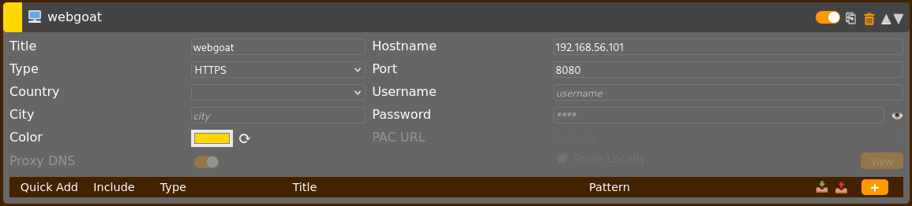

Anyway, ymmärsin tätä kautta, että tämmöiseen weppihyökkäilyjen harjoitteluun proxyjen asettaminen on simulaatio siitä, kun hyökkääjä kaappaa uhrin
verkkoliikennettä ja reitittää esim. juurikin välimiehenä (man-in-the-middle) uhrin pyynnöt palvelimelle ja palvelimelta takaisin uhrille. Tarkoituksena
nähdä uhrin lähetysten sisältö. Oikeassa maailmassa tämä voisi tapahtua esim. ARP spoofauksella, jolla hyökkääjä saa uskoteltua uhrille toimivansa reitittimenä.

Asetetaan tuleville tehtäville proxy localhostiin, tällä kertaa. Ymmärtääkseni tämä olisi toiminut myös edelliseenkin WebGoatin harjoittelussa, mutta olin hieman
tietämättömämpi. Zapista jäi kuva ottamatta, mutta siellä pystyi asettamaan proxyn osoitteen `Tools -> Options -> Network -> Local proxies` ja asettamalla sieltä
esim. tähän tapaukseen osoitteeksi `127.0.0.1`.

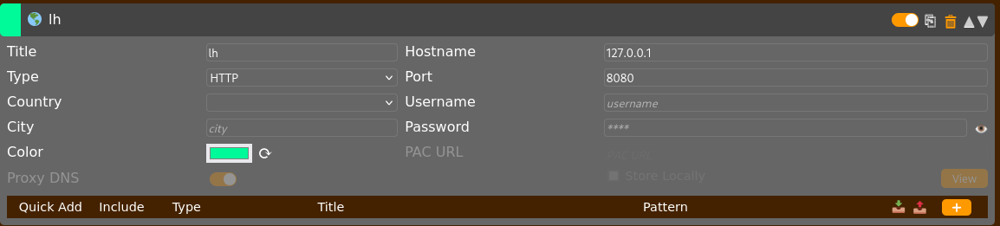

Voidaan myös asettaa proxy toimimaan vain tietyille verkkosivuille. Käytin tähän omaa palvelintani. Tällöin Foxyproxy voidaan asettaa proxymaan vain kun url osuu
oikeaan.

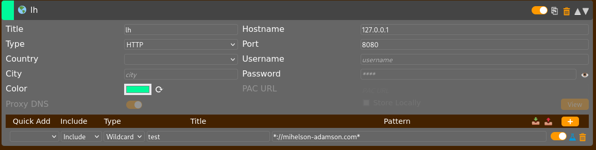

Eli pattern asettamalla Foxyproxy näyttää asetuksen `Proxy by Patterns`, joka tekee edellä selitetyn tilanteen mukaisesti.

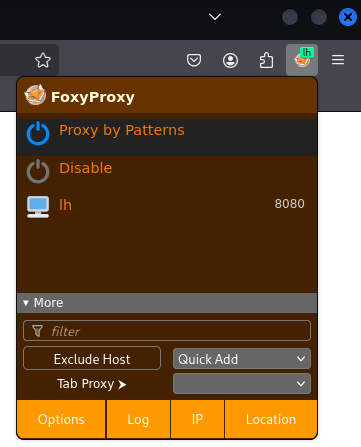

Käydään nyt verkkosivulla. Ensin ilman HTTPS:ssää. Oikealla kulmassa näkyy Foxyproxyn vihreä väri, jossa lukee `lh`, eli proxylle antamani nimi.

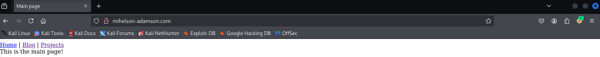

Kävin myös kalin omalla verkkosivulla testaamassa toimiiko `Proxy by Patterns`. Kuten näkyy, niin oikealla kulmassa on erivärinen Foxyproxyn `lh`, joka tarkoittaa
sen olevan pois päältä. Näitä ei myös näy Zapissa.

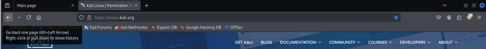

Koska Zapissa oli valmiiksi asennettu yksi CA-sertifikaatti, menin suoraan nyt vain mitään säätämättä https:llä samalle sivulle. Vastaan tulee Firefoxin varoitus.
Huomaa myös miten Firefox näkee sertifikaatin olevan MITM-proxyhyökkäyksille ominainen.

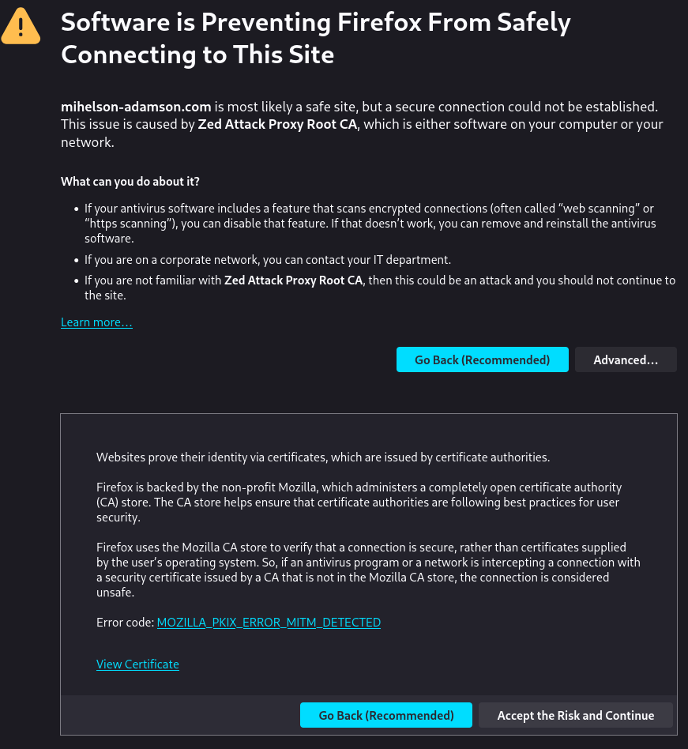

Painamalla `Accept the Risk and Continue` selain hyväksyy sertifikaatin ja jatkaa sivulle.

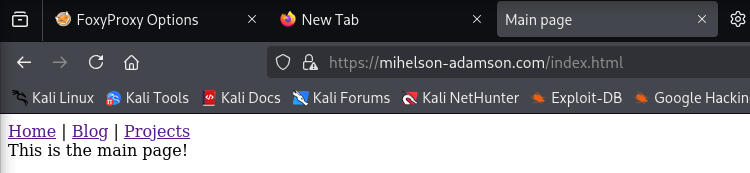

Alla näkyy Zapin lokit kaikista http ja https testeistä verkkosivulla.

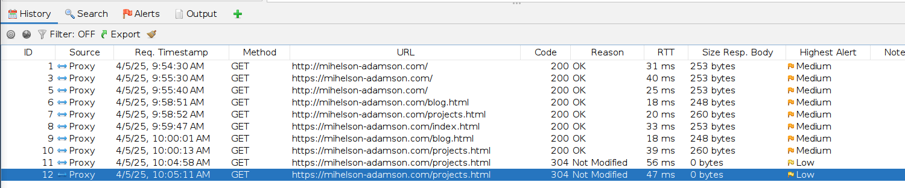

Alla näkyvä taitaa olla sitemap, joka näyttää sivun rakennetta. Se näyttää vain verkkosivun ne osat, joilla on käyty. Jos haluaa nähdä eri osat verkkosivulla 
itse käymättä tarvitaan jokin crawleri tai fuzzeri, jotka etsivät tarkoituksella kaikki mahdolliset osat verkkosivusta joista tulee vastauksia, vrt. porttiskannaukseen.

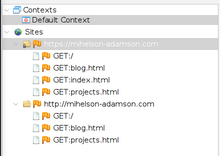

- c)
> Reflected XSS into HTML context with nothing encoded

Tämä oli ensimmäinen kerta ikinä, kun alan edes ajattelemaan näitä XSS asioita. Meni hetki kunnes ymmärsin mitä tässä tehtävässä edes halutaan tapahtuvan.

Siirryin tässä kohtaa testaamaan Burppia[^2], koska sitä kehuttiin niin paljon viime tunnilla olleen puhujan puolesta. Burp oli helppo setuppaa, eikä se 
tarvinnut erikseen proxyn säätämistä, koska Burpissa avataan sen oma chrome-based selain.

Luin PortSwiggerin tehtävänannon alta olevaa artikkelia XSS-hyökkäyksistä[^1], jolloin asia alkoi selventyä. Tarkoituksena näyttää olevan asettaa `<script>`
-blokkeja paikkoihin, esim. hakukenttiin, joissa niitä ei odoteta olevan. Riittävän naiivi koodi ei tarkista sisällön puhtautta, jolloin kun tällainen `<script>`
-blokki laitetaan palvelimen toimesta verkkosivulle, toimii se ikään kuin se olisi sinne koodattu suoraan HTML:nä.

Tätä voidaan testata, asetetaan hakukenttään jotain erikoisia HTML-kielen roippeita ja tarkistetaan, mitä tulee ulos. Ohessa olen asettanut search-kenttään 
```
'<test><
```

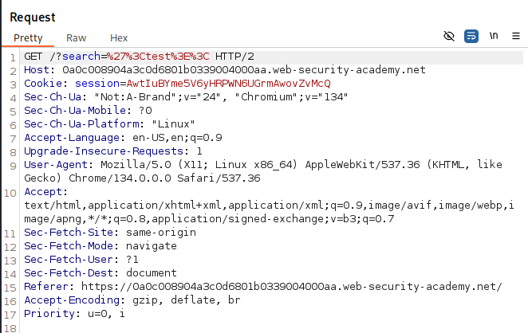

ja kuinka ollakkaan, HTML-koodissa alla näkyy tuo kokonaisuudessaan, se myös rikkoi `<h1>`-blokin samalla. Olettaa siis voi, että myös skriptaus toimisi.

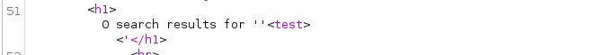

Vaikka script-blokin voisi suoraan laittaa tässä tapauksessa hakukenttään, halusin kuitenkin kokeilla Burpin intercept työkalua. Sillä näen alkuperäisen 
kyselyn, jonka selain lähettää. Kyselyä muokkaamalla nähdään myös täppä requestin lokissa Burpissa, jolloin helposti löytyy myös ne kyselyt joita on käyty
turmelemassa.

Alla näkyy selaimen lähettämä pyyntö ja meidän turmelema. Käpälöityyn pyyntöön on muutetty `GET`-pyynnössä `hello -> <script>alert('hello')</script>'` joka 
suoritti tehtävän onnistuneesti.

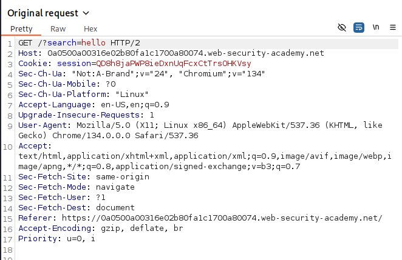

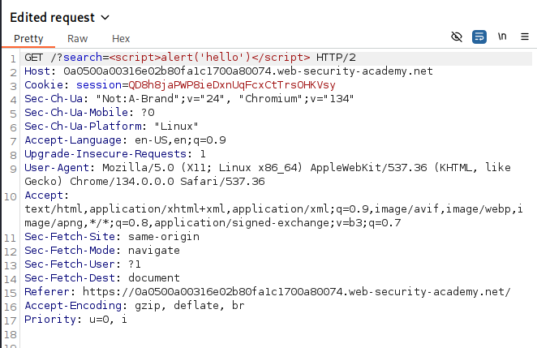

- d)
> Stored XSS into HTML context with nothing encoded

No, nyt kun ollaan jo XSS-ammattilaisia, niin tehtävänannosta oli helppo arvata, mitä nyt tulee tehdä. Mennään kommentoimaan ja tehdään sama juttu uudelleen.
Rivillä 23 näkyy alkuperäinen kommentti.

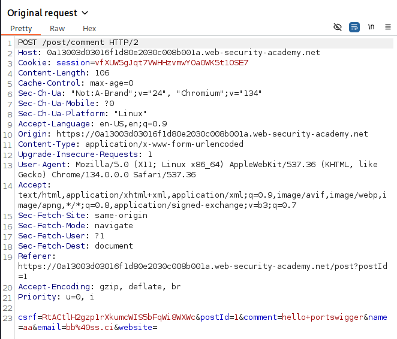

Ja taas rivillä 23 näkyy nyt muunneltu kommentti, joka sisältää script-blokin.

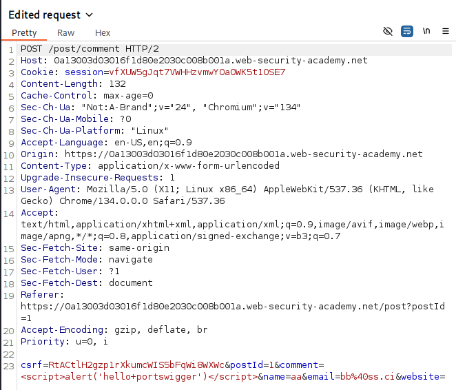

Arvelin myös, että tähänkin voi asettaa scriptin suoraan kommenttikenttään ja niinhän siinä voikin.. Rivillä näkyy, hieman huonommin tällä kertaa, koska 
erikoismerkit ovat muunneltuja selaimen puolesta. Tiesin tämän toimineen, koska selain näytti minulle huomautuksen, jossa luki `hello portswigger`.

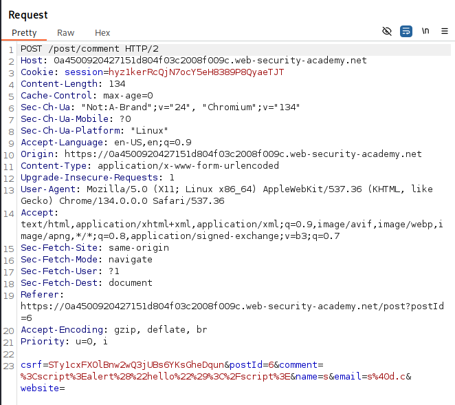

- e) 
> File path traversal, simple case. Laita tarvittaessa Zapissa kuvien sieppaus päälle.

Path traversal terminä oli jo tuttu, samoin sen idea myös, joten tästä ei tarvinnut hirveästi mitään extraa lukea, toisin kuin edelliset kohdat.

Testasin tätä vaihteeksi kokonaan selaimessa. Avasin tehtävässä näytettyä kuvaa `right-click -> open image in new tab`. Selaimen urlia tarkastellen näin, että 
kuva haettiin `image?filename=2.jpg` tyyliin. PortSwiggerin tehtävänantokin sitä vähän vihjaili, että tulisi etsiä `/etc/passwd`-tiedoston sisältöä, joten heitin
mielivaltaisen määrän `../`-palikoita filenamen perään, koska linuxilla sillä ei ainakaan ole merkitystä, kaikki taaksepäin meno loppuu lopulta roottiin, eikä 
siitä pääse taaksepäin. Kaiken lopuksi laitoin `/etc/passwd`-lopun, eikä selaimessa ainakaan tullut mitään erroria.

Avasin network tabin ja refreshasin, jolloin löysin kuvaformaatissa tuon haetun tiedoston sisällön. 

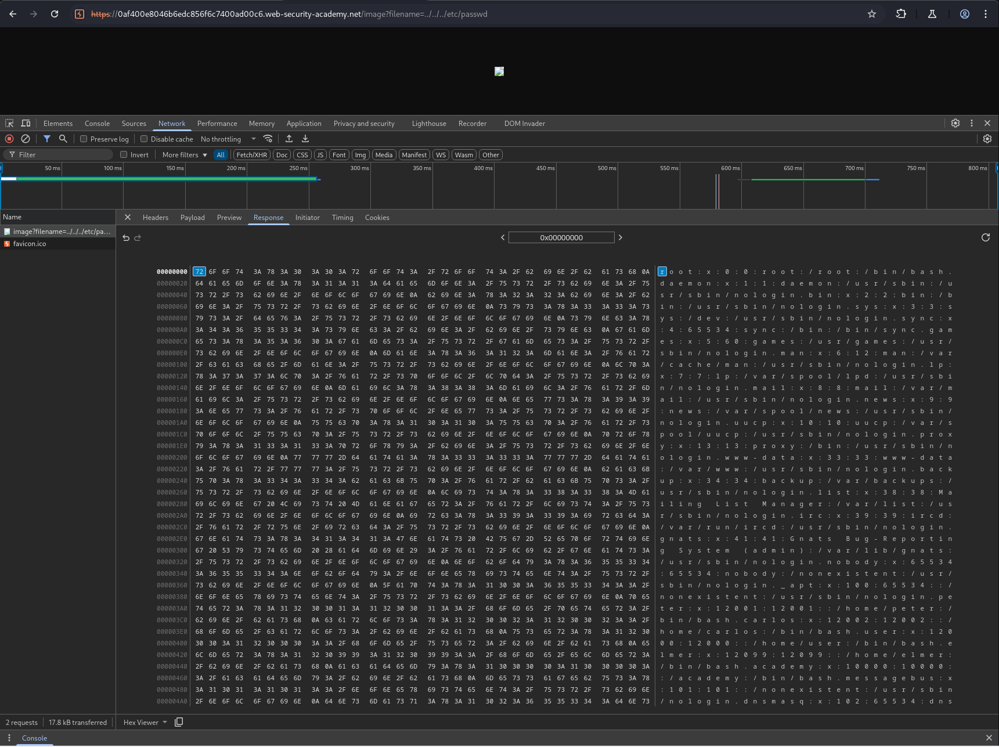

Annoin vielä selaimen muuntaa sen UTF formaattiin.

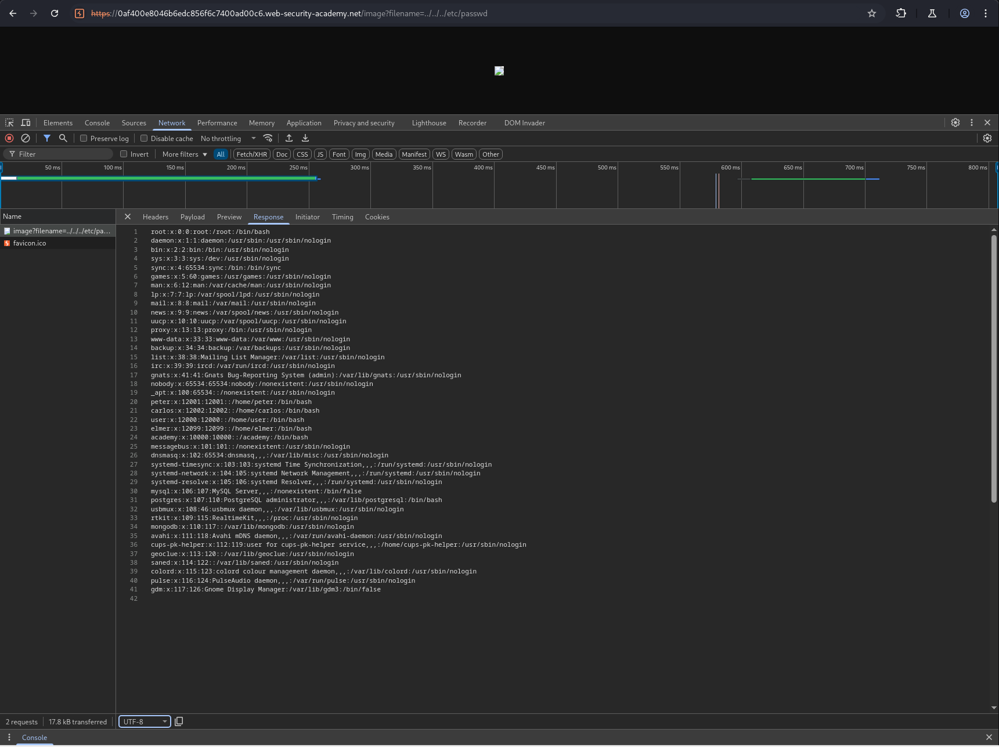

Palasin takaisin tehtävän etusivulle ja tehtävä näkyi ratkaistuna.

- f)
> File path traversal, traversal sequences blocked with absolute path bypass

Tehtävän nimi paljastaa suoraan mitä pitää tehdä, eli tehdään sama kuin edellä, mutta sen sijaan, että mennään hakemistoissa taaksepäin, niin nyt voidaan
antaa absoluuttinen polku. Toisin sanoin tehdään sama `image?filename=`-haku ja laitetaan siihen suoraan `/etc/passwd`.

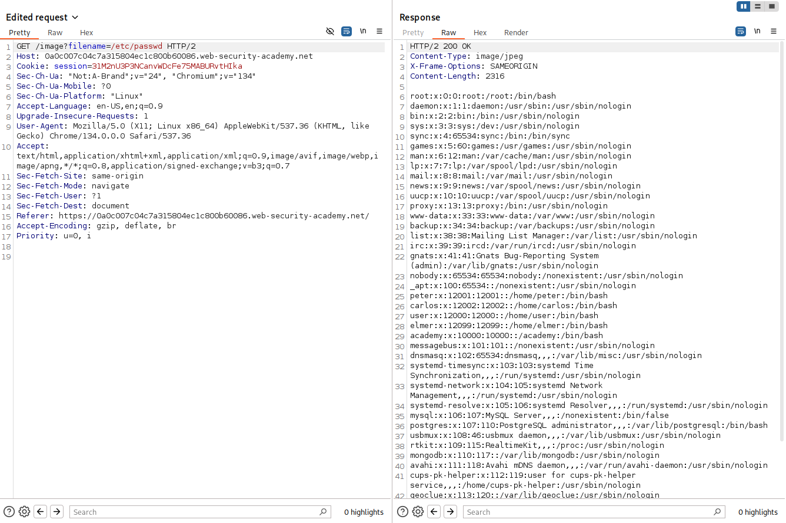

- g)
> File path traversal, traversal sequences stripped non-recursively

Tässäkin tehtävänanto spoilasi jo ainakin mielestäni. Kun luin tuon traversal sequences stripped non-recursively, niin aloin miettimään miten sen itse tekisin, jos
haluaisin VAIN poistaa `../`-palaset. Noh, siitä ainakin tuli mieleen, että mitä jos lisään vain kaksinkertaisen määrän sitten palasia, eli `....//`, ainakaan oma 
nopea purkkaratkaisu ei tätä osaisi korjata.. Laitoin taas mielivaltaisen määrän palikoita peräkkäin. Ulos tulee odotettu vastaus.

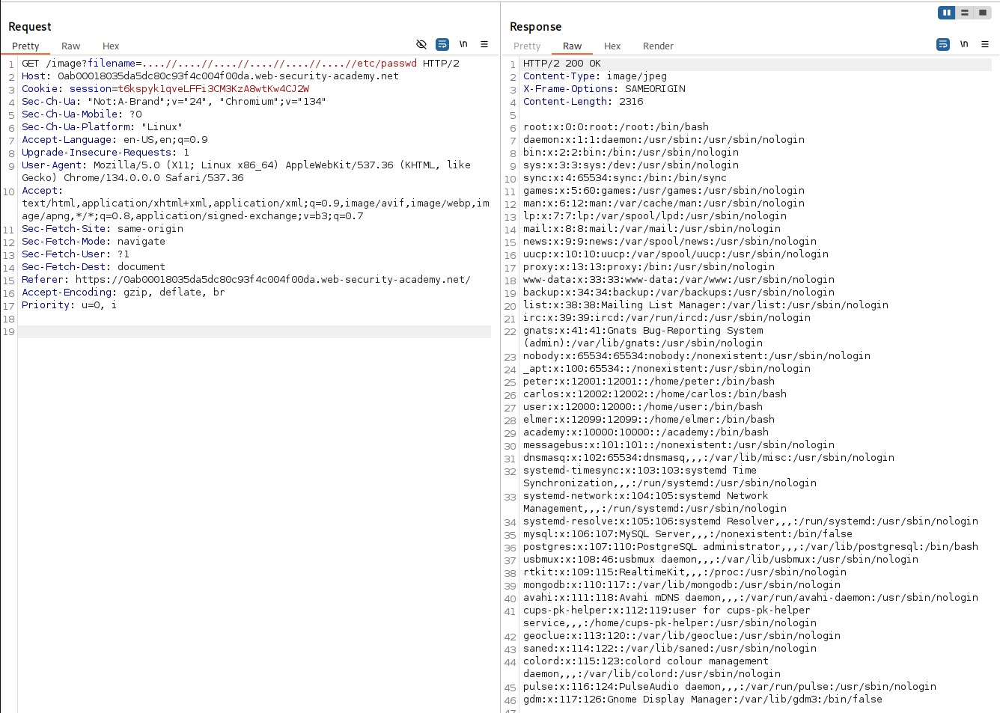

- h)
> Insecure direct object references

Tässä tehtävässä menikin hetki aikaa pohtia, että mitä tässä oli tarkoitus tehdä. Menin ensimmäisenä chattailemään ja huomasin kyllä tuon chatlogin tallennusnappulan, 
mutta en ajatellut sitä sen enempää. Hetken aikaa pyörittyäni ympyrää päätin, että olisi hyvä hetki käydä lukemassa, että mistä on kyse IDOR:ssa[^5]. Siellä hetken 
lueskeltua, huomasin, että kyse on siis sanitoinnin puutteesta kun haetaan palvelimelta, eikä palvelin tarkista onko sen palautettava tieto edes käyttäjälle kuuluvaa.

Eli periaatteessa, kun tehtävän tarkoitus oli löytää carlos-nimisen käyttäjän salasana, niin se pitäisi löytyä jotenkin niin, että saan palvelimen palautettua 
tietoa, joka kuuluisi carlokselle, eikä minulle.

Ensimmäisenä palasin chatlogiin, tarkastelin juuri tallentamaani tiedostoa, joka oli tyhjä. Kiinnitin huomiota, että chatlogitiedoston nimi oli `2.txt`, jolloin
alkoikin vihdoin kellot kilistä ja menin tallentamaan uuden chatlogin, jonka tällä kertaa interceptaan ja muutan sen pyytämään tiedostoa, jonka nimi olisi `1.txt`.

Kuinka ollakkaan, niin response tulikin carloksen käymä keskustelu chattibotin kanssa salasanansa varmistamisesta. Onneksi asiat ei taida kuitenkaan näin huonosti 
olla oikeassa elämässä.

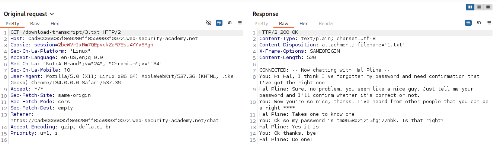


- i)
> Basic SSRF against the local server

Tämä oli sellainen aihe taas, että oli pakko lähteä lukemaan PortSwiggerin artikkelia aiheesta[^4]. Siellä keskustellaan, että SSRF-hyökkäykset tyypillisesti
koostuvat pyynnöistä, jossa hyökkääjä saa palvelimen tekemään pyynnön paikallisessa verkossaan, jolloin todennäköisemmin esim. admin-endpointtiin pääsee 
käsiksi ilman tunnuksia. Artikkelihan selvensi aika paljon.

Menin suoraan tehtävänannon perusteella tarkastelemaan tuotteen stockiin liittyvää pyyntöä. Huomasin siellä, että palvelin tekee `stockApi`-pyynnön, johon 
tietty nyt tässä kontekstissa täytyy tunkea se `http://localhost/admin` ja katsoa mitä käy. 

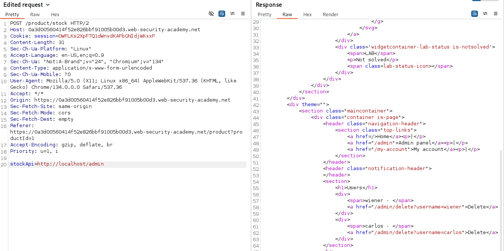

Responena tulee adminin dashboard, jossa on suoraan jo käyttäjien poistoon liittyvät komennot. Kokeilin tietty myös selaimelta vain painaa carloksen kohdalle 
`delete user`-nappia, mutta se ei toiminut tietenkään, vaan sekin pitää tehdä loopbackilla.

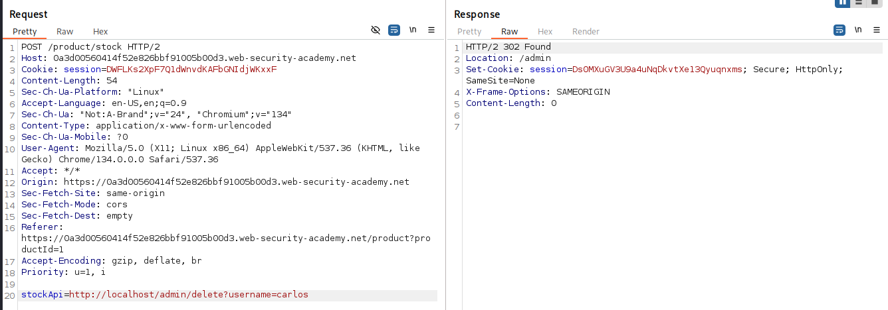

Ja näin carloksen käyttäjä on poistettu, harmi.

- j)
> Vapaaehtoinen, hieman haastava: Server-side template injection with information disclosure via user-supplied objects

Lukemalla taas hieman aiheeseen liittyvää[^3] opitaan, että tarkoituksena on antaa templatelle vähän jotain laskettavaa. Seuraavassa kuvassa muutin viimeiselle riville
```python
{{ product.name }} -> {{ 7*7 }}
{{ product.stock }} -> {{ 7*'7' }}
```

Tästä pitäisi tulla artikkelin mukaan jotain virhettä, jonka pitäisi paljastaa taustalla olevasta ohjelmasta jotain.

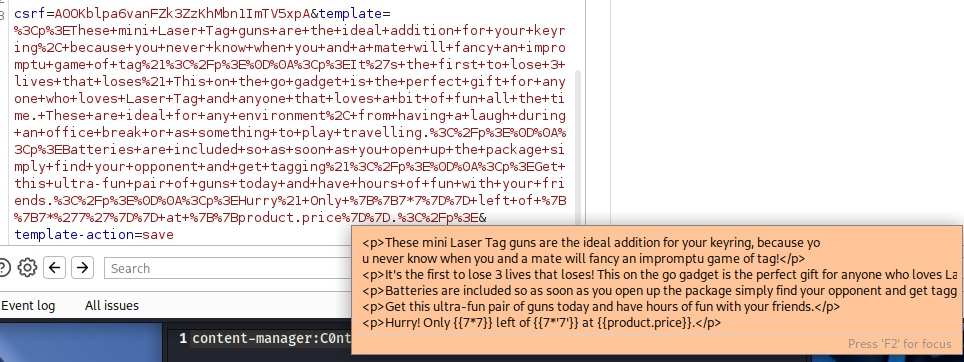

Virheilmoitus näkyy selaimessa, ja paljastaa, että dataa käsittelee python2.7 ja django. 
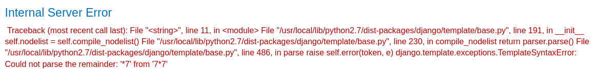

Tiesin itse kokemuksesta, että djangolla on oma template language, 
googlamalla `django template exposed in ssti` kaksi ensimmäistä lähdettä sanoo, että kannattaa testata vastaako palvelin pyyntöön jossa siltä kysytään palauttamaan
`{{ settings.SECRET_KEY }}`[^7][^8]

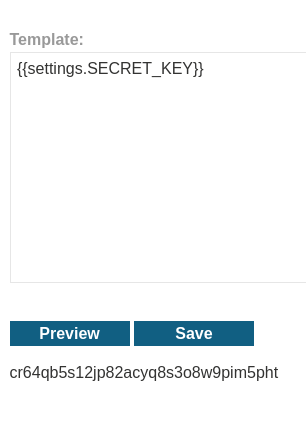

Näytti tällä kertaa toimivan.

- k)
> Vapaaehtoinen, helppo: Asenna pencode ja muunna sillä jokin merkkijono (encode a string).

Alla testasin jotain `hello world`-kaltaisen tekstin muuntamista.
```bash
┌──(kali㉿kali)-[~]
└─$ echo "hello worldb/?|" | pencode b64encode
aGVsbG8gd29ybGRiLz98                                                                             
┌──(kali㉿kali)-[~]
└─$ echo "hello worldb/?|" | pencode urlencode
hello+worldb%2F%3F%7C                                                                             
```
Testasin tässä myös nyt vasta äskettäin opittua double encoded tekstin muuntamista kahdesti.
```bash
┌──(kali㉿kali)-[~]
└─$ echo "hello%252fworld"|pencode urldecode  
hello%2fworld                                                                             
┌──(kali㉿kali)-[~]
└─$ echo "hello%252fworld"|pencode urldecode|pencode urldecode
hello/world
```

# Ympäristötiedot

Löytyvät tämän github repon [environment.md-tiedostosta.](https://github.com/p-lemonish/course-penetration-testing/blob/master/environment.md)

# Lähteet
[^1]: PortSwigger, What is cross-site scripting (XSS), https://portswigger.net/web-security/cross-site-scripting#what-is-cross-site-scripting-xss
[^2]: PortSwigger, Burp, https://portswigger.net/burp
[^3]: PortSwigger, What is server-side template injection?, https://portswigger.net/web-security/server-side-template-injection#what-is-server-side-template-injection
[^4]: PortSwigger, What is SSRF?, https://portswigger.net/web-security/ssrf#what-is-ssrf
[^5]: PortSwigger, What is access control?, https://portswigger.net/web-security/access-control#what-is-access-control
[^6]: PortSwigger, What is path traversal?, https://portswigger.net/web-security/file-path-traversal#what-is-path-traversal
[^7]: Murkhadin Beschokov, What is Server Side Template Injection?, https://www.wallarm.com/what/server-side-template-injection-ssti-vulnerability
[^8]: Busra Demir, A Pentester’s Guide to Server Side Template Injection (SSTI), http://medium.com/@bdemir/a-pentesters-guide-to-server-side-template-injection-ssti-c5e3998eae68
