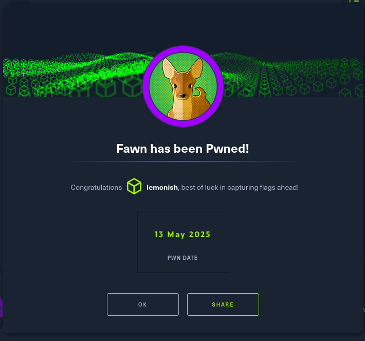

# h6 Maalisuoralla
Tehtävänanto: Tero Karvinen, Tunkeutumistestaus, https://terokarvinen.com/tunkeutumistestaus/

## Tehtävä x) Lue/katso ja tiivistä.

> - Deviant Ollam

## Tehtävä a) Lippuvalmistelu

> Tästä kohdasta ei tarvita kattavaa raporttia, riittää pelkkä luettelo siitä, miten ratkaisit allaolevat kysymykset.
Jos sinulla on esimerkiksi valmis, toimiva Kali VM tavallisella PC:llä, tässä ei tarvitse tehdä juuri mitään.

> - amd64

Käytössä on kurssia varten asennettu Kali VM amd64 arkkitehtuurilla.

> - Netti

Kalilla on tarvittaessa verkkoyhteys.

> - Too many secrets

Salaisuudet on tallennettu VM:n ulkopuolelle.

> - Työkalut

Käytössä on vain työkalut, joita Kalilla on entuudestaan.

> - Muistiinpanot

OK.

> - Paikallinen tekoäly

Ei tule olemaan käytössä, mutta mielenkiintoinen idea.

## Tehtävä b) Oma korkki

Omaa korkkia on hyvä esitellä samalla, kun harjoittelee lipunryöstöä varten.
Ratkotaan lisää HTB:n tehtäviä.

Ratkotaan Tier0 Fawn [HackTheBoxilta](https://app.hackthebox.com/starting-point).

Ensiksi testataan verkkoyhteyden puute muualle maailmaan, ja sitten kohteeseen.

```bash
$ ping 8.8.8.8
PING 8.8.8.8 (8.8.8.8) 56(84) bytes of data.
^C
--- 8.8.8.8 ping statistics ---
2 packets transmitted, 0 received, 100% packet loss, time 1018ms

$ ping 10.129.1.14
PING 10.129.1.14 (10.129.1.14) 56(84) bytes of data.
64 bytes from 10.129.1.14: icmp_seq=1 ttl=63 time=45.7 ms
64 bytes from 10.129.1.14: icmp_seq=2 ttl=63 time=46.0 ms
^C
--- 10.129.1.14 ping statistics ---
2 packets transmitted, 2 received, 0% packet loss, time 1002ms
rtt min/avg/max/mdev = 45.683/45.820/45.957/0.137 ms
```

> What does the 3-letter acronym FTP stand for?

FTP

> Which port does the FTP service listen on usually?

21

> FTP sends data in the clear, without any encryption.
What acronym is used for a later protocol designed to provide similar functionality to FTP but securely, as an extension of the SSH protocol?

SFTP

> What is the command we can use to send an ICMP echo request to test our connection to the target?

ping

> From your scans, what version is FTP running on the target?

```bash
$ nmap -T4 -A 10.129.1.14
Starting Nmap 7.95 ( https://nmap.org ) at 2025-05-13 11:46 EDT
...snip...
PORT   STATE SERVICE VERSION
21/tcp open  ftp     vsftpd 3.0.3
| ftp-anon: Anonymous FTP login allowed (FTP code 230)
|_-rw-r--r--    1 0        0              32 Jun 04  2021 flag.txt
| ftp-syst:
|   STAT:
| FTP server status:
|      Connected to ::ffff:10.10.14.197
|      Logged in as ftp
|      TYPE: ASCII
|      No session bandwidth limit
|      Session timeout in seconds is 300
|      Control connection is plain text
|      Data connections will be plain text
|      At session startup, client count was 3
|      vsFTPd 3.0.3 - secure, fast, stable
|_End of status
Device type: general purpose|router
Running: Linux 5.X, MikroTik RouterOS 7.X
OS CPE: cpe:/o:linux:linux_kernel:5 cpe:/o:mikrotik:routeros:7 cpe:/o:linux:linux_kernel:5.6.3
OS details: Linux 5.0 - 5.14, MikroTik RouterOS 7.2 - 7.5 (Linux 5.6.3)
Network Distance: 2 hops
Service Info: OS: Unix
...snip...
```

vsFTPd 3.0.3

> From your scans, what OS type is running on the target?

Näyttää olevan Unix

> What is the command we need to run in order to display the 'ftp' client help menu?

`ftp -?`. Myös jos lukee ftp:n man sivut ennen yhdistämistä voi lukea lisätietoja siitä,
mitä mikäkin komento tekee.[^1].

> What is username that is used over FTP when you want to log in without having an account?

Anonymous[^2].

> What is the response code we get for the FTP message 'Login successful'?

`230 Login successful.`

> There are a couple of commands we can use to list the files and directories available on the FTP server. One is dir.
What is the other that is a common way to list files on a Linux system.

`ls` listaa tiedostot.

> What is the command used to download the file we found on the FTP server?

`get flag.txt`

> Submit root flag

```bash
$ cat flag.txt
035...snip...815
```

Fawn pwned



# Ympäristötiedot

Löytyvät tämän github repon [environment.md-tiedostosta.](https://github.com/p-lemonish/course-penetration-testing/blob/master/environment.md)

# Viittaukset
[^1]: Linux man page, ftp, https://linux.die.net/man/1/ftp
[^2]: The RFC Series, How to Use Anonymous FTP, https://www.rfc-editor.org/rfc/rfc1635
